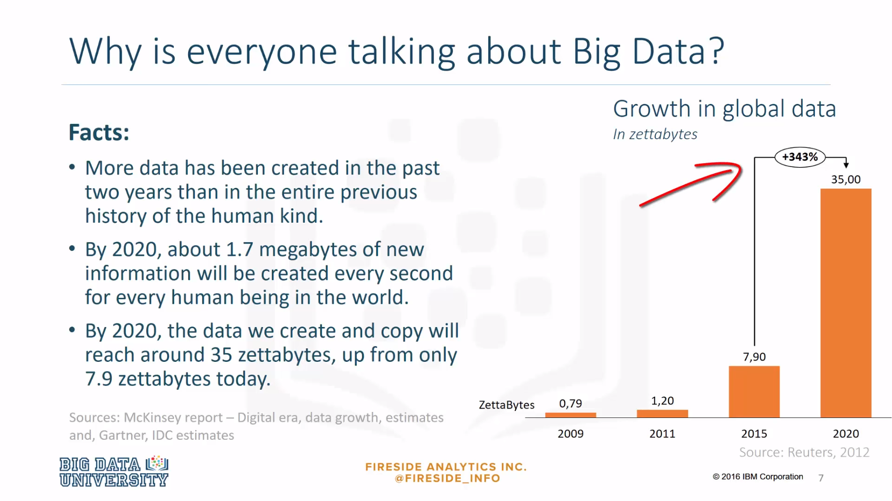
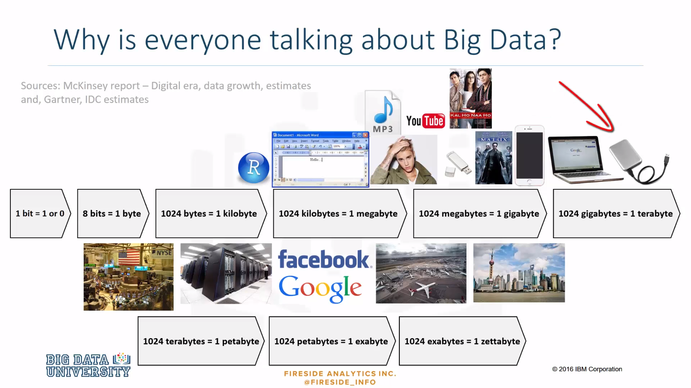
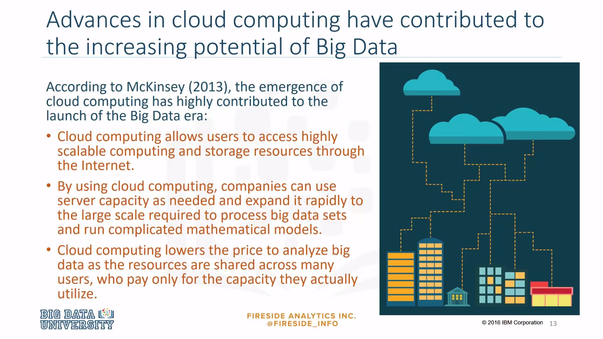
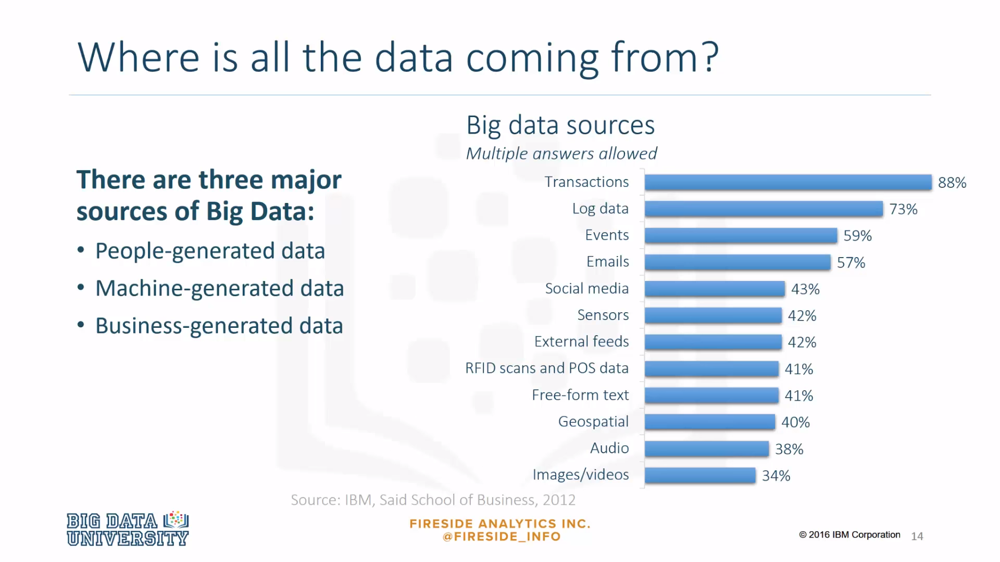
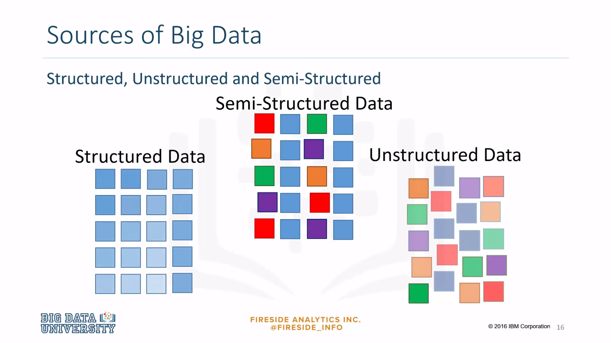
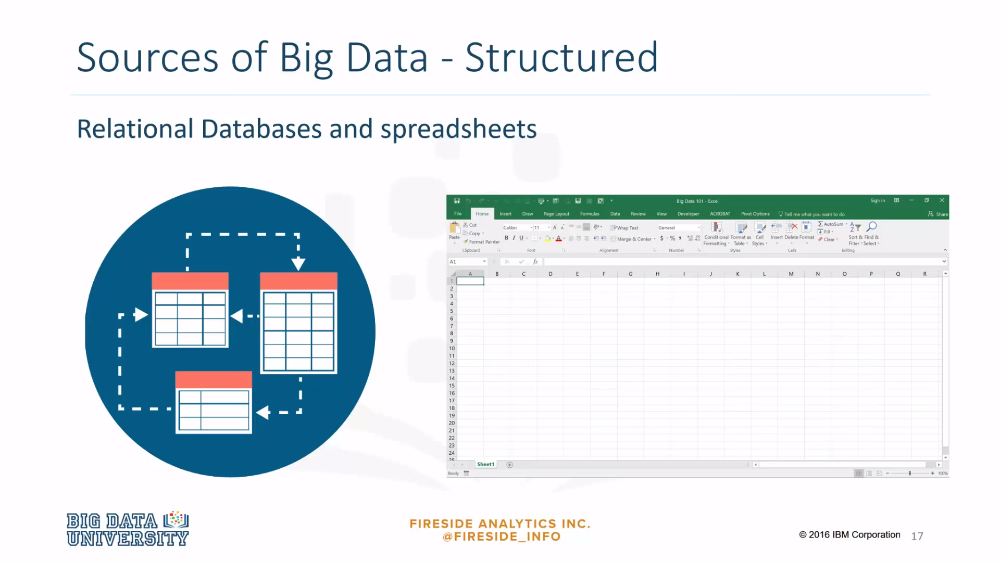
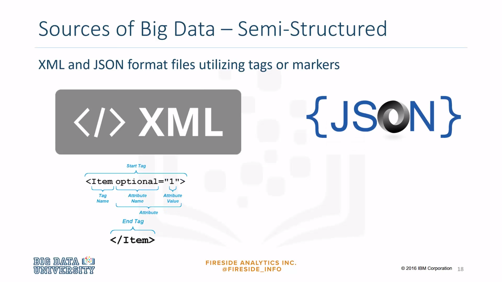
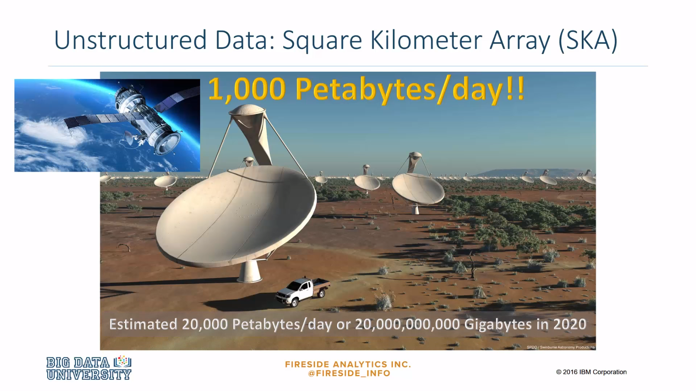
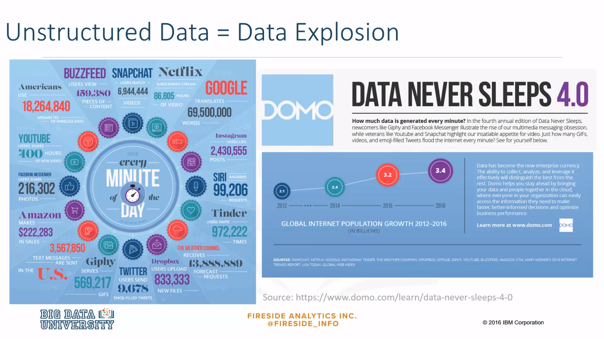
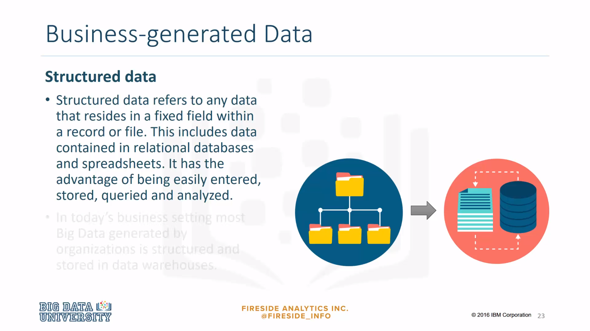

### why is everyone talking about Big Data
***

So why is everyone talking about Big Data? More data has been created in the past two years than in the entire history of humankind. **By 2020, about 1.7 megabytes of new information will be created every second for every human being in the world**. By 2020, the data we create and copy will reach around **35 zettabytes, up from only 7.9 zettabytes today**. The chart on the right shows the growth in global data in zettabytes. Note the **jump from 2015 to 2020 of 343%**. 

### How big is a **zettabyte**?
***

How big is a **zettabyte**? One bit is **binary**. It's either a one or a zero. Eight bits make up one **byte**, and 1024 bytes make up one **kilobyte**. 1024 kilobytes make up one **megabyte**. Large videos and DVDs will be in **gigabytes** where 1024 megabytes make up one gigabyte of storage space. These days we have USBs or memory sticks that can store a few dozen gigabytes of information where computers and hard drives now store **terabytes** of information. One terabyte is 1025 gigabytes. 1024 terabytes make up one **petabyte**, and 1024 petabytes make up an **exabyte**. 

Think of a big urban city or a busy international airport like Heathrow, JFK, O'Hare, Dubai, or O. R. Tambo in Johannesburg. And now we're talking petabytes and exabytes. All those airplanes are capturing and transmitting data. All the people in those airports have mobile devices. Also consider the security cameras and all the staff in and around the airport. **A digital universe study conducted by IDC claimed digital information reached 0.8 zettabytes** last year and predicted this number would grow to 35 zettabytes by 2020. It is predicted that by 2020, one tenth of the world's data will be produced by machines, and most of the world's data will be produced in emerging markets. It is also predicted that the amount of data produced will increasingly outpace available storage. 

### Advances in cloud computing have contributed to the increasing potential of Big Data
***

According to McKinsey in 2013, the emergence of cloud computing has highly contributed to the launch of the Big Data era. 

Cloud computing allows users to access highly scalable computing and storage resources through the internet. 

By using cloud computing, companies can use server capacity as needed and expand it rapidly to the large scale required to process big data sets and run complicated mathematical models.

Cloud computing lowers the price to analyze big data as the resources are shared across many users, who pay only for the capacity they actually utilize. 

### Where is all the data comming from?
***

A survey by IBM and SAID Business School identified three major sources of Big Data. People-generated data, machine-generated data, and business-generated data, which is the data that organizations generate within their own operations. The chart on the right shows different responses where responders were allowed to select multiple answers. Big Data will require analysts to have Big Data skills. Big Data skills include discovering and analyzing trends that occur in Big Data. 

### Sources of Big Data
***

Big Data comes in three forms. **Structured, unstructured, and semi-structured**. 

**Structured data** is data that is organized, labelled, and has a strict model that it follows. 

**Unstructured data** is said to make up about **80% of data in the world**, where the data is usually in a text form and does not have a predefined model or is organized in any way. 

And **semi-structured data** is a combination of the two. It is similar to structured data, where it may have an organized structure, but lacks a strictly-defined model. 

### Some sources of structured Big Data
***

Some sources of structured Big Data are **relational databases and spreadsheets**. With this type of structure, we know how data is related to other data, what the data means, and the data is easy to query, using a programming language like SQL. 

### Some sources of semi-structured Big Data
***

Some sources of semi-structured Big Data are **XML and JSON files**. These sources use tags or other markers to enforce hierarchies of records and fields within data. 

### Unstructured Data - Square Kilometer Array
***

A large multi-radio telescope project called Square Kilometer Array, or SKA, produced about 1000 petabytes, in 2011 at least, of raw data a day. It is projected that it will produce about 20,000 petabytes or 20 billion gigabytes of data each day in 2020.

### Unstructured Data = Data Explosion
***

Currently, there is an explosion of data coming from internet activity and in particular, video production and consumption as well as social media activities. These numbers will just keep growing as internet speeds increase and as more and more people all over the world have access to the internet. 

### Business-generated Data
***

Structured data refers to any data that resides in a fixed field within a record or file. It has the advantage of being easily entered, stored, queried, and analyzed. In today's business setting, most Big Data generated by organizations is structured and stored in data warehouses. Highly structured business-generated data is considered a valuable source of information and thus equally important as machine and people-generated data.