### Content
***

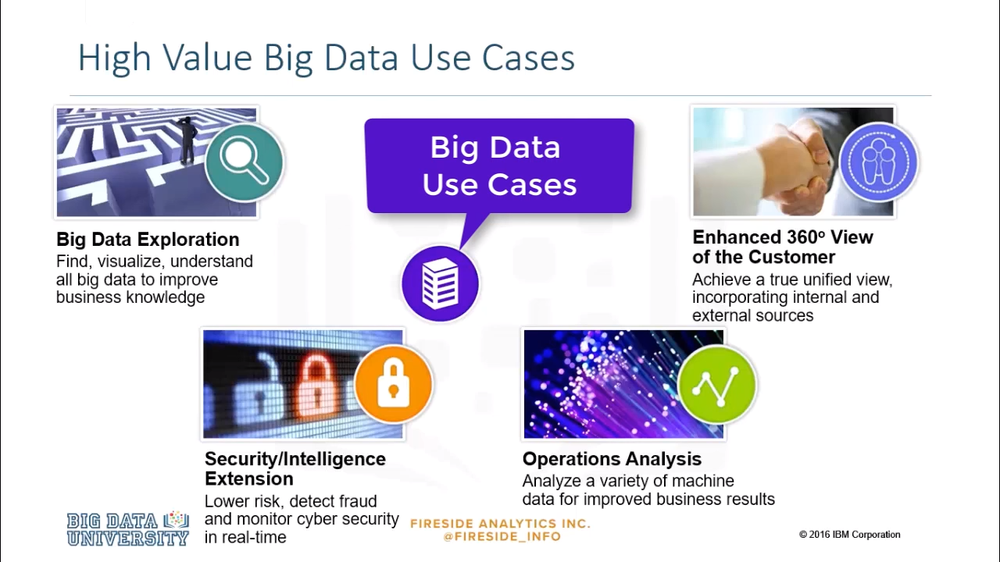

* **big data exploration** to find, visualize and understand big data to improve business knowledge. 
* **enhanced 360 degree view**: this is a way of looking at the customer to achieve a true unified view, incorporating internal and external data sources. 
* **security and intelligence extension**, to lower risk, detect fraud, and monitor cyber security in real-time.
* **operations analysis** to analyze a variety of machine data to improve business results. 

### Big data exploration
***

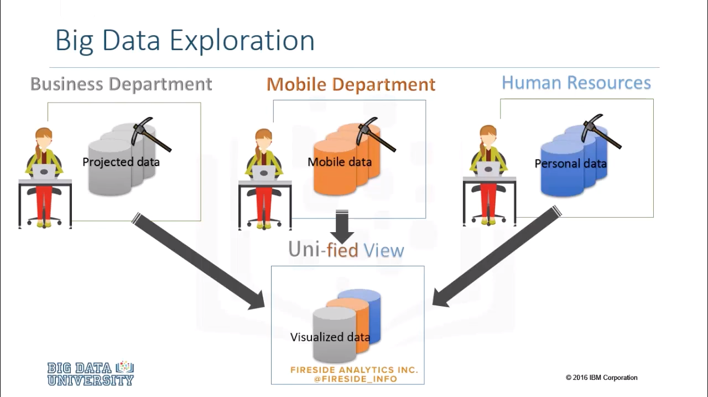

Big data exploration addresses the challenge faced by every large organization. Business information is spread across multiple systems and silos, big data exploration enables you to explore, and mine big data to find, visualize and understand all your data, to improve decision making. By creating a unified view of information across all data sources, both inside and outside of your organization, you gain enhanced value and new insights. 

### Big data exploration - Example
***

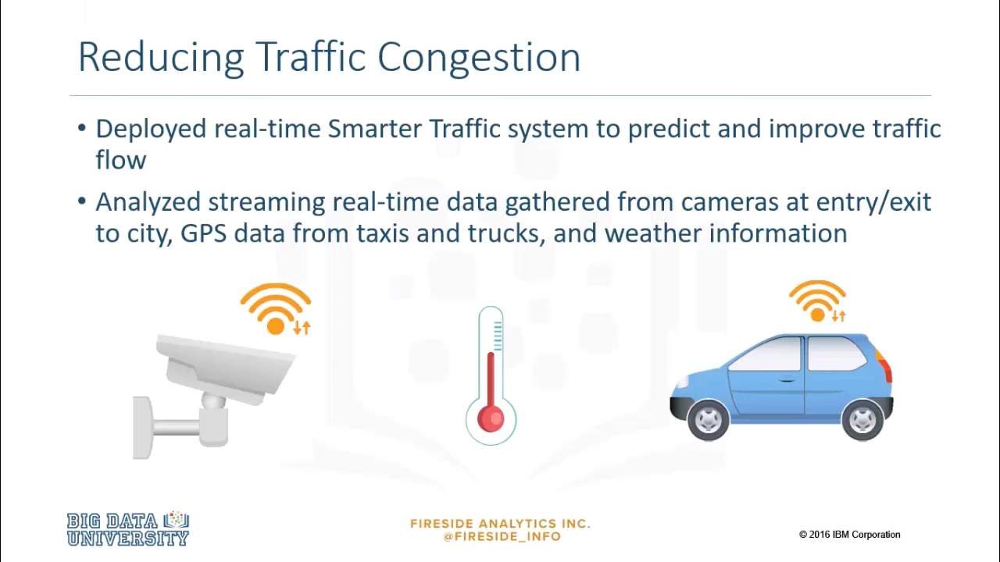

Let's look at a transportation example. By using data from different systems such as cameras at different points in a city, weather information, and GPS data from Uber, taxis, trucks and cars, we can predict traffic at a faster and more accurate pace to deploy real-time, smarter traffic systems that improve traffic flow. There are many positive benefits from this, including reduced fuel emissions, public transportation planning, and longer-lasting transportation infrastructure. 

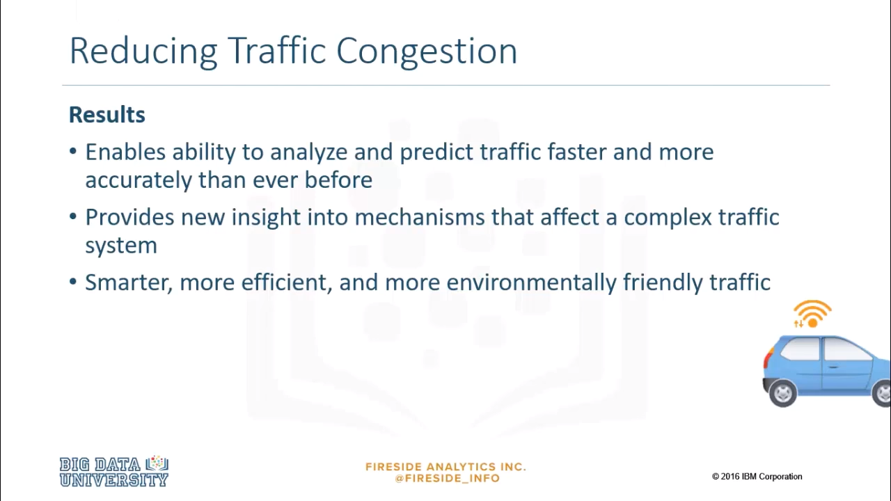

With the advent of self-driving cars, machine learning algorithms can be trained using historical and real-time data from human-driven cars on the road, this would teach the driverless car how real drivers behaved in different traffic situations in varying weather conditions and circumstances. 

### Enhanced 360 degree View of the Customer
***

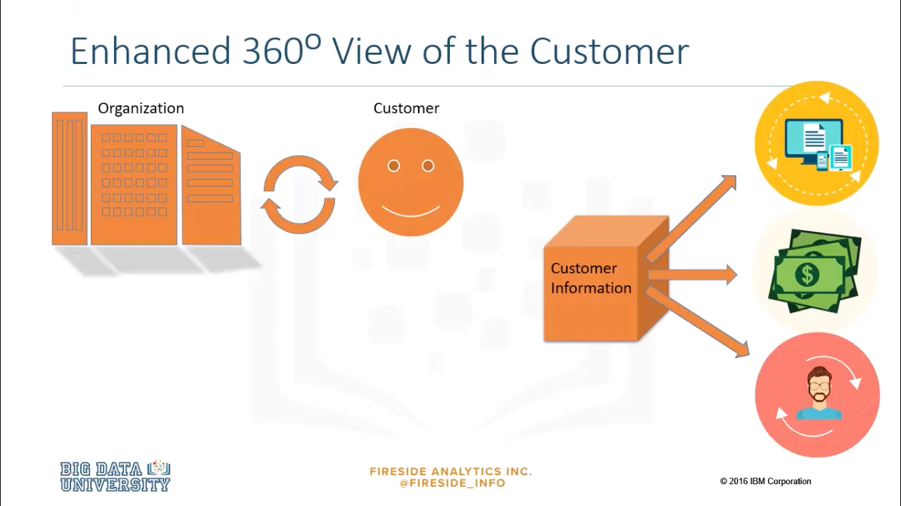

In the digital era, the touch points between an organization and its customers have increased many times over, organizations now require specialized solutions to effectively manage these connections. An enhanced 360 degree view of the customer is a holistic approach, that takes into account all available and meaningful information about the customer to drive better engagement, revenue, and long-term loyalty. This is the basis for modern customer relationship management, or CRM systems. 

### Enhanced 360 degree View of the Customer - Example
***

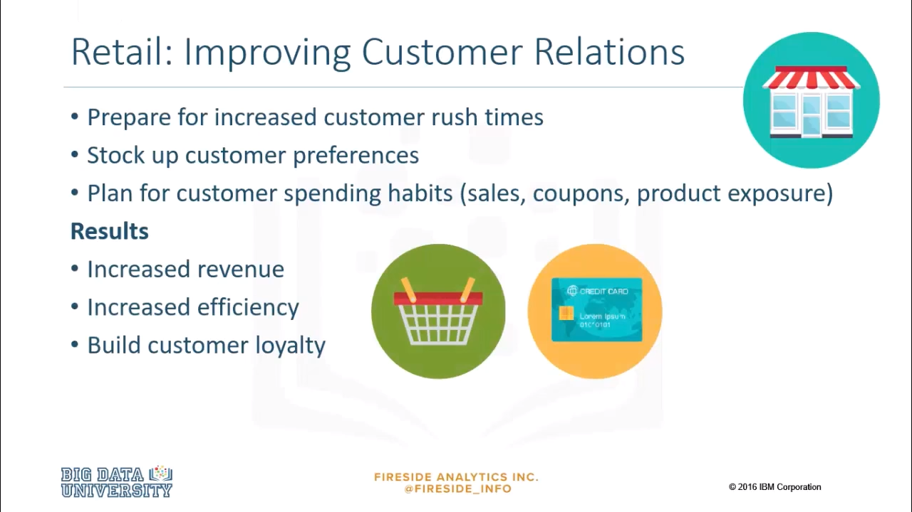

Let's look at an example in detail. By taking an enhanced 360 degree view of the customer, and taking available and meaningful information such as spending habits, shopping behavior and preferences, grocery stores are able to plan, prepare, and provide better services to customers. 

### Security/Intelligence Extension
***

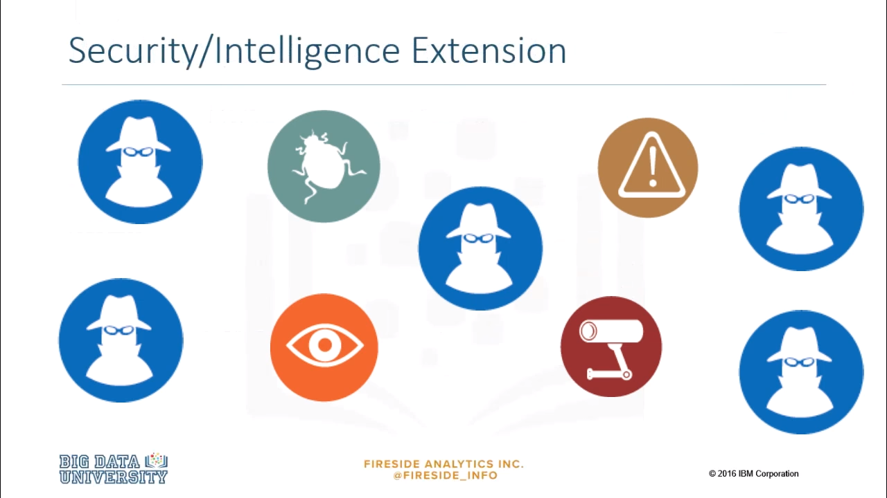

The growing number of high-tech crimes, cyber-based terrorism, espionage, computer intrusions, and major cyber fraud cases, poses a real threat to every individual and organization. 

### Improving Security
***

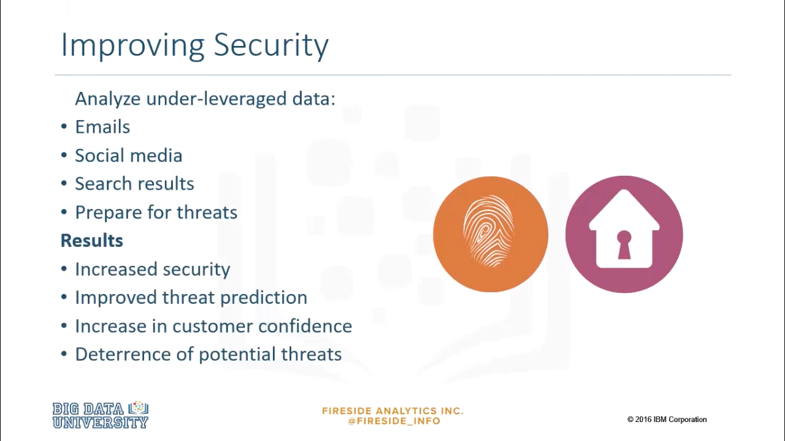

To meet these security challenges, businesses are using big data technologies to change and enhance their cyber security and intelligence activities, how? By processing and analyzing new data types, such as social media, emails, and analyzing hours and hours of video footage. Analyzing data in motion, and at rest, can help find new associations, or uncover patterns and facts to significantly improve intelligence, security, and law enforcement. 

### Operations Analysis
***

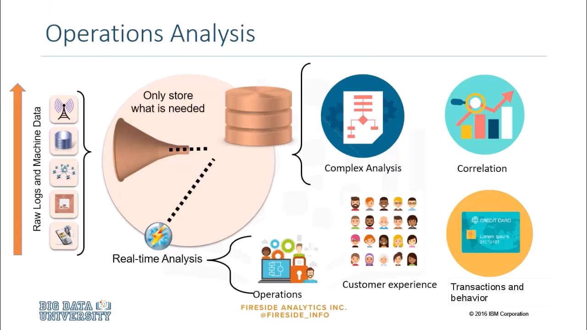

Operations analysis focuses on analyzing machine data, which can include anything from signals, sensors, and logs, to data from GPS devices. This type of data is growing at an exponential rate, and it comes in large volume, and a variety of formats. Using big data for operations analysis, organizations can gain real-time visibility into operations, customer experience, transactions, and behavior. Big data empowers businesses to predict when a machine will stop working, when machine components need to be replaced, and even when employees will resign. 

### Operations Analysis - Example
***

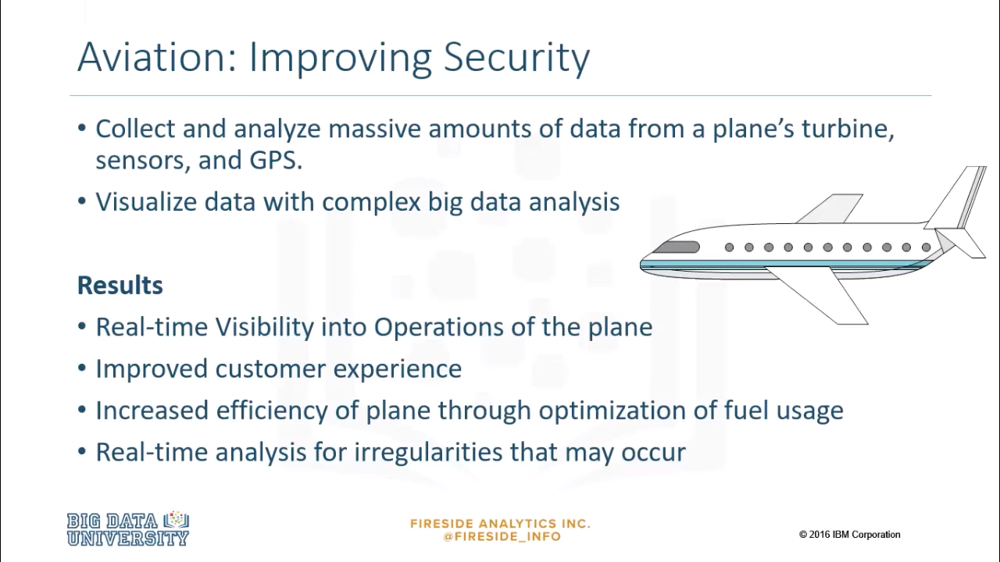

Let's look at an example. Airplane engines generate large amounts of data every second. By analyzing this massive amount of data from the turbine, and even other sensors on the plane such as GPS, temperature, and speed, organizations are able to gain real-time visibility into the operations of the plane. This data is used to run the aircraft safely and efficiently, and in the unlikely event of a crash, this data can also tell air crash investigators exactly what caused the accident. Many present-day aviation regulations and protocols have come from the data collected in past incidents. 

### Personalized recommendations 
***

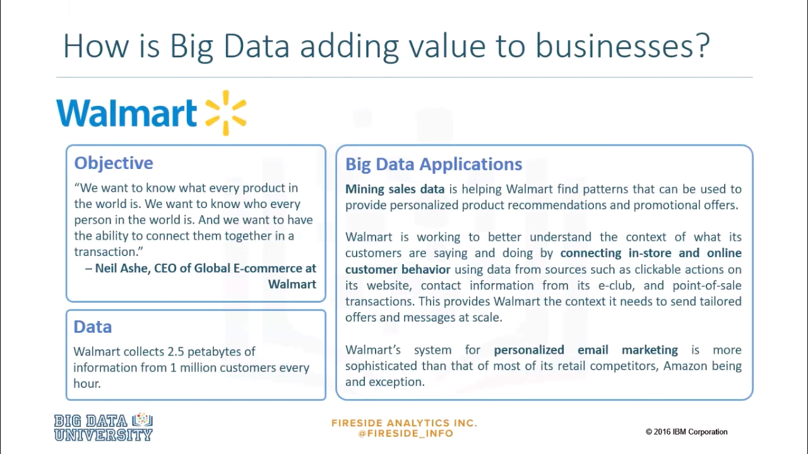

Walmart consistently sends tailored product offers based on customer behavior, online and in stores. Walmart has also enjoyed success in email marketing campaigns by optimizing the time that offers are sent. Walmart tracks each campaign's open rate, and realigns delivery times based on individual user patterns.