### Key Aspects of a Big Data Platform
***

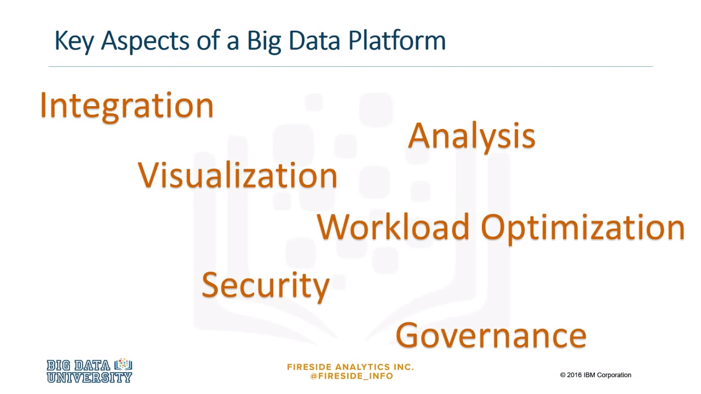

When we look at big data, we can start with a few broad topics: **integration, analysis, visualization, optimization, security, and governance**. 

### Integration
***

Let's start off with a quick definition of **integration**. 

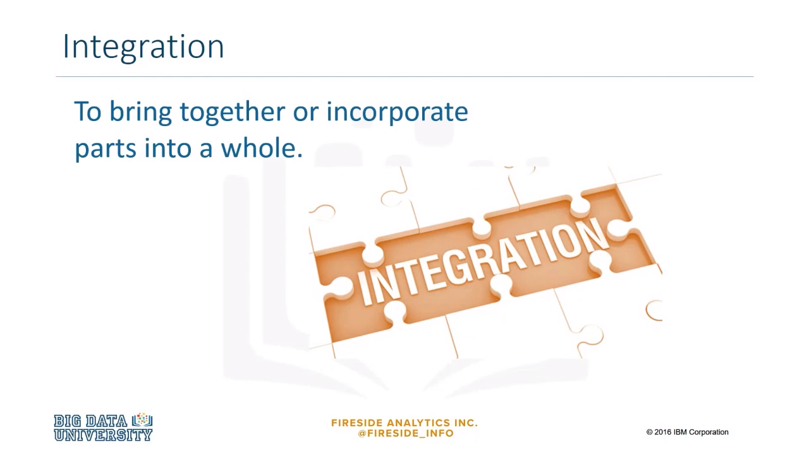

To integrate means to bring together or incorporate parts into a whole. 

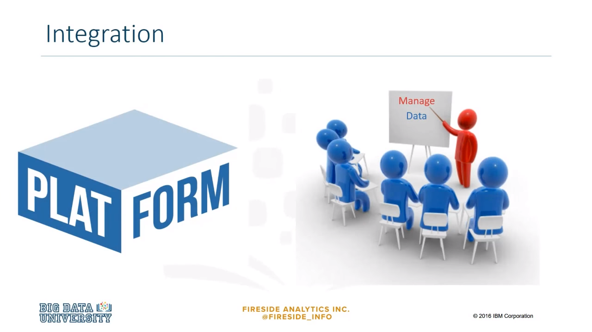

In big data, it would be ideal to have one platform to manage all of the data, rather than individual silos, each creating separate silos of insight. 

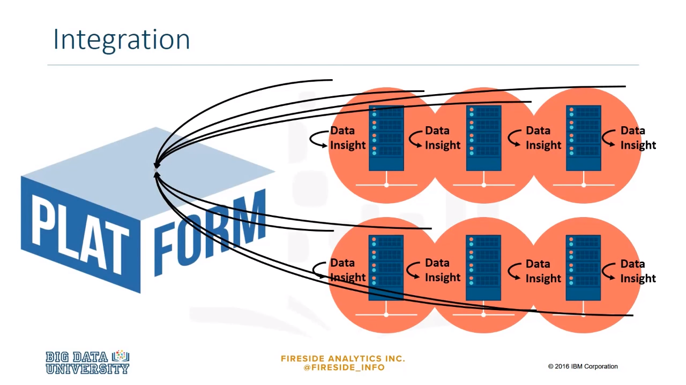

Big data has to be bigger than just one technology or one enterprise solution which was built for one purpose. For example, a bank should be thinking about how to integrate its retail banking, its commercial banking, and investment banking. 

### Integration - Example
***

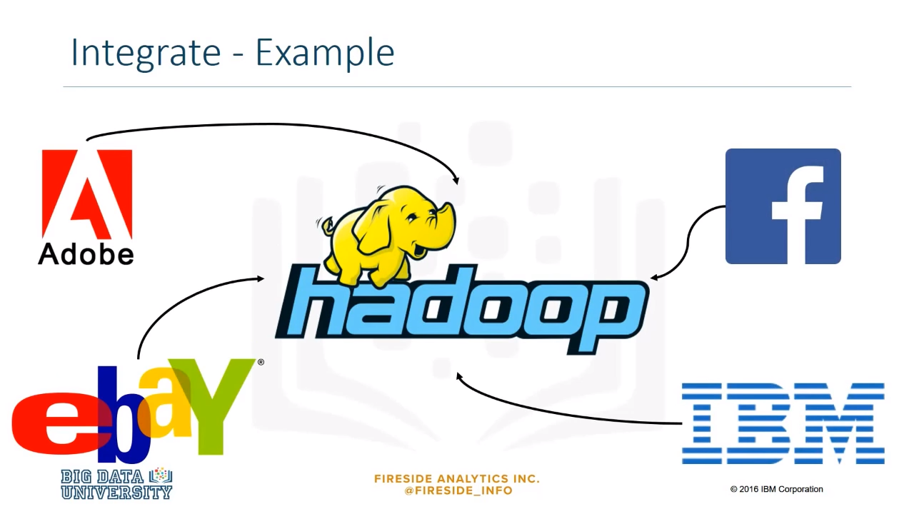

One way to be bigger than one technology is to use Hadoop when dealing with big data. A Hadoop distributed file system, or HDFS, stores data for many different locations, creating a centralized place to store and process the data. Many large companies make use of Hadoop in their technologies. 

### Analysis 
***

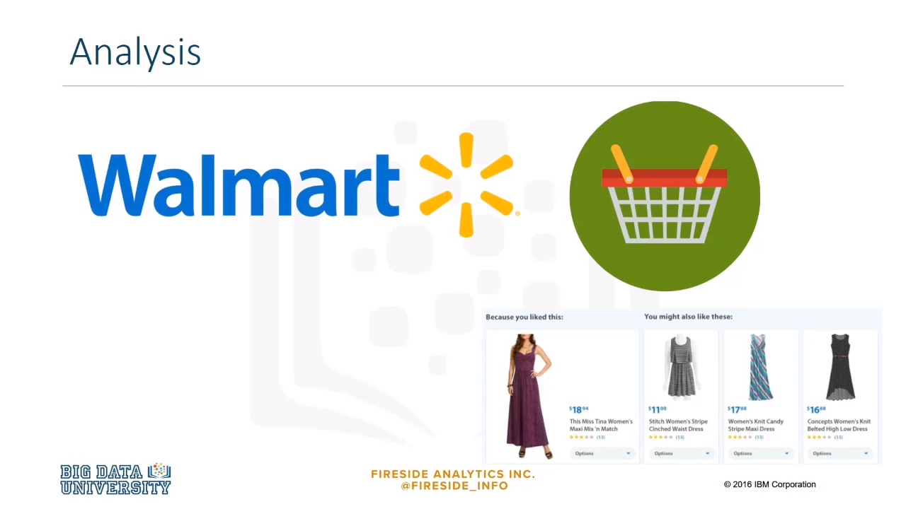

Let's look at a Walmart example. **Walmart utilizes a search engine called Polaris**, which helps shoppers search for products they wish to buy. It takes into account how a user is behaving on the website in order to surface the best results for them. Polaris will bring up items that are based on a user's interests and, because many consumers visit Walmart's website, large amounts of data are collected, making the analysis on that big data very important. 

### Visualization
***

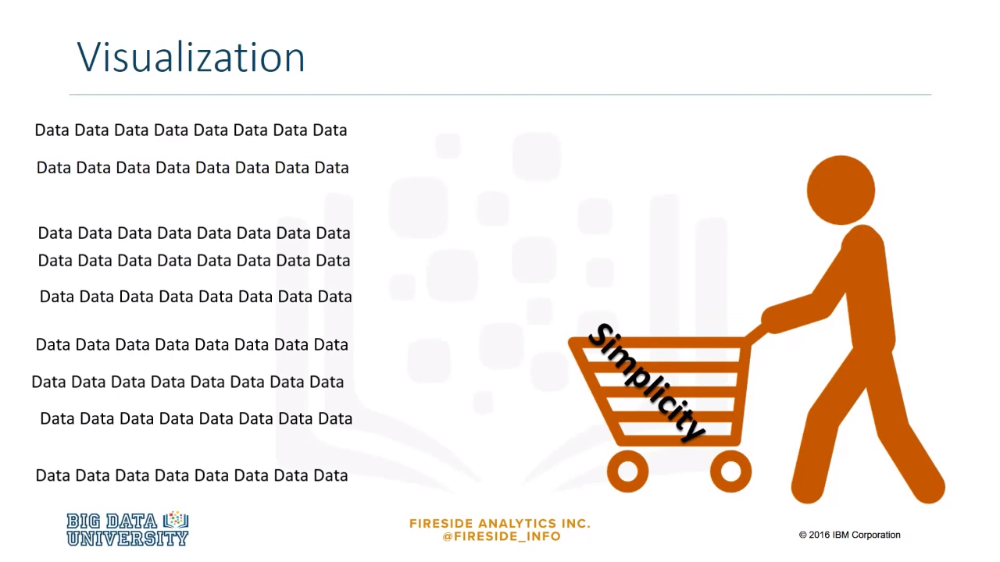

Some people work well with tables of data, however, the vast majority of people need big data to be presented to them in a graphical way so they can understand it. Data visualization is helpful to people who need to analyze the data, like analysts or data scientists, and it is especially useful to non-technical people who need to make decisions from data, but don't work with it on a daily basis. 

### Visualization - Example
***

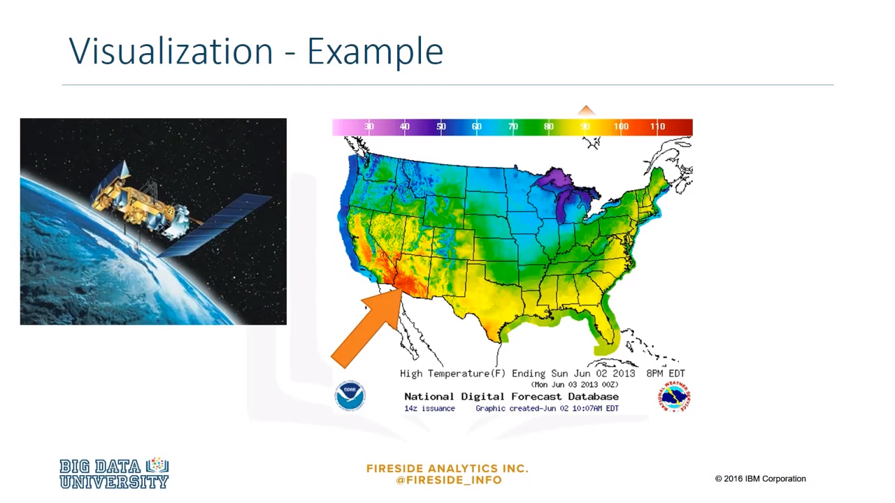

An example of visualizing big data is in displaying temperature on a map by region. By using the massive amounts of data collected by sensors and satellites in space, viewers can get a quick and easy summary of where it's going to be hot or cold. 

### Security and governance
***

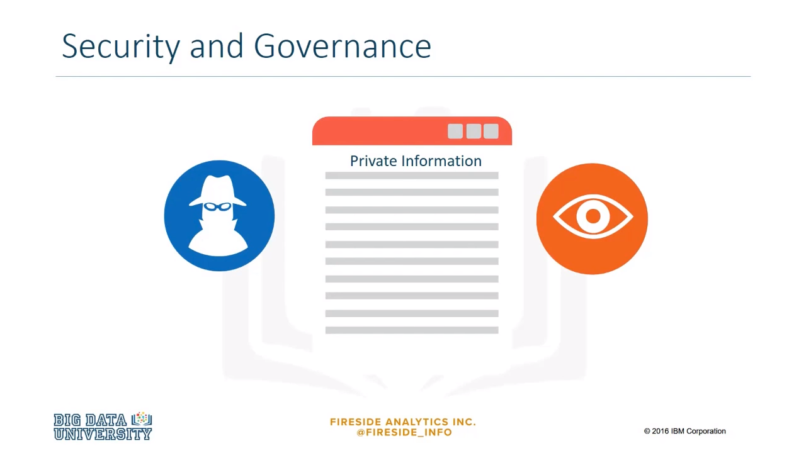

Data privacy is a critical part of the big data era. Business and individuals must give great thought to how data is collected, retained, used, and disclosed. A privacy breach occurs when there is unauthorized access to or collection, use, or disclosure of personal information and, often, this leads to litigation. Companies must establish strict controls and privacy policies in compliance with the legal framework of the geographic region they are in. 

### Governance 
***

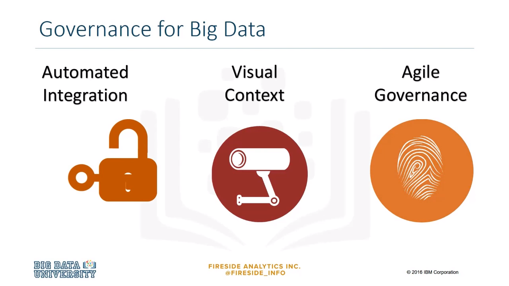

Big data governance requires three things: automated integration, that is, easy access to the data wherever it resides, visual content, that is, easy categorization, indexing, and discovery within big data to optimize its usage, agile governance is the definition and execution of governance appropriate to the value of the data and its intended use. Looking at these three things provides businesses with a quick way to profile the level of importance of the data and, therefore, the amount of security required to protect it. 

### Big Data Skill
***

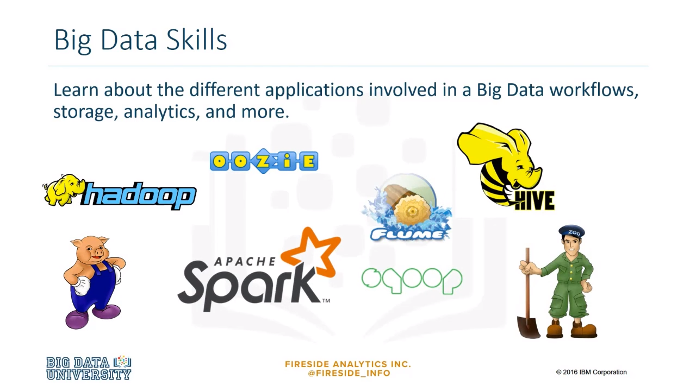

Some of the applications used in big data are Hadoop, Oozie, Flume, Hive, HBase, Apache Pig, Apache Spark, MapReduce and YARN, Sqoop, ZooKeeper, and text analytics. We need people with the skills to run these applications and analyze big data. 

### Big Data related to Data Science
***

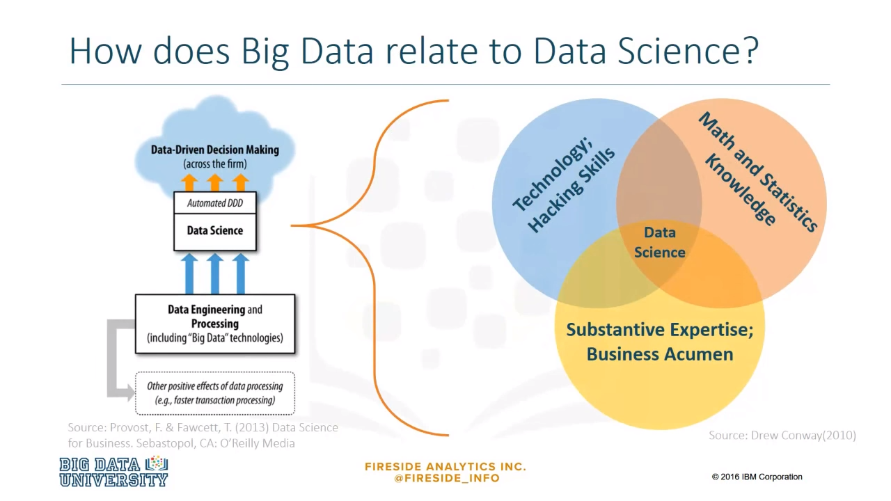

**Data science** is the **process of cleaning, mining, and analyzing data to derive insights of value from it**. In data science, the size of the data is less important. One can use data of all sizes, small, medium, and big data that is related to a business or scientific case. Insights are extracted through a combination of exploratory data analysis and modeling. 

### How can we make sense of Big Data?
***

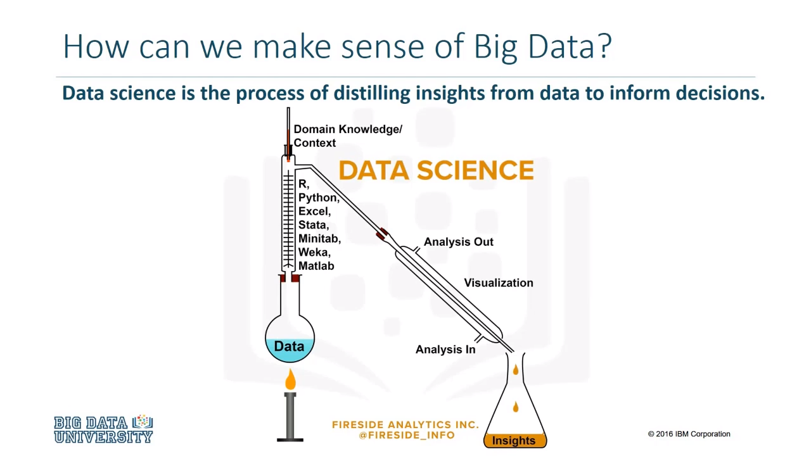

Data science is the process of distilling insights from data to inform decisions. A data scientist is a person who is qualified to derive insights from data by using skills and experience from computer science, business, or science, and statistics. 

### Data Scientist Skills
***

Here are more skills that a data scientist must have. 

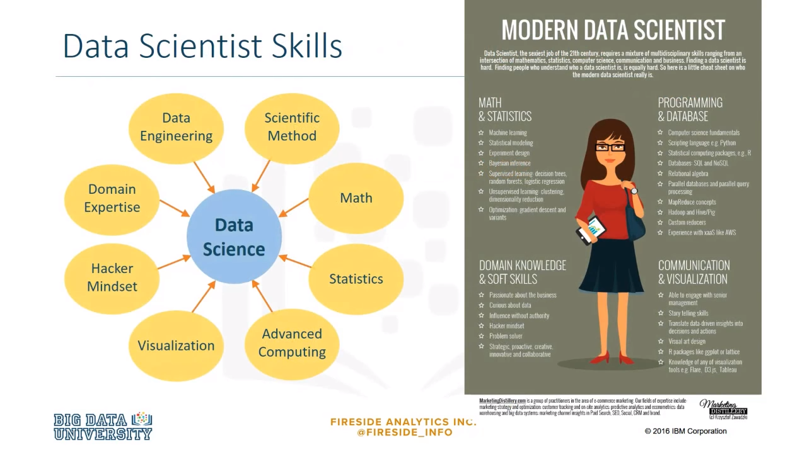

### How can we make sense of Big Data? (continue)
***

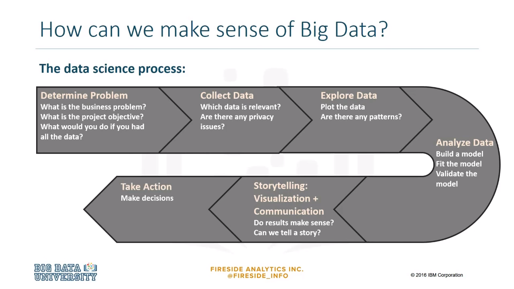

One can use the following process to make sense of big data. 

* Determine problem. 
	* What is the business problem? 
	* What is the project objective? 
	* What would you do if you had all the data? 

* Collect data. 
	* Which data is relevant? 
	* Are there any privacy issues? 

* Explore the data. 
	* Plot the data. 
	* Are there any patterns? 
	
* Analyze the data. 
	* Build a model. 
	* Fit the model. 
	* Validate the model. 
	
* Storytelling. 
	* Visualization plus communication. 
	* Can we tell a story? 
	
* Take action and make decisions.