### Components and Ecosystem of Big Data
***

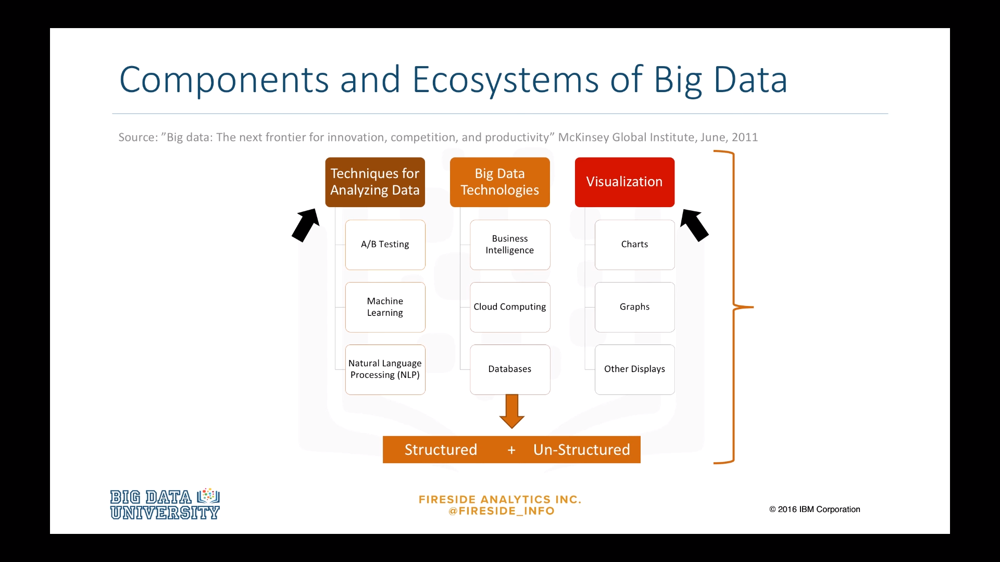

In a report by the McKinsey Global Institute from 2011, the main components and ecosystems are out outlined as follows: Techniques for Analyzing Data, such as A/B Testing, Machine Learning, and Natural Language Processing. Big Data Technologies like Business Intelligence, Cloud Computing, and Databases. Visualization such as Charts, Graphs, and Other Displays of the data. The Big Data processing technologies we will discuss work to bring large sets of structured and un-structured data into a format where analysis and visualization can be conducted. Value can only be derived from Big Data if it can be reduced or repackaged into formats that can be understood by people. 

### Big Data Technologies
***

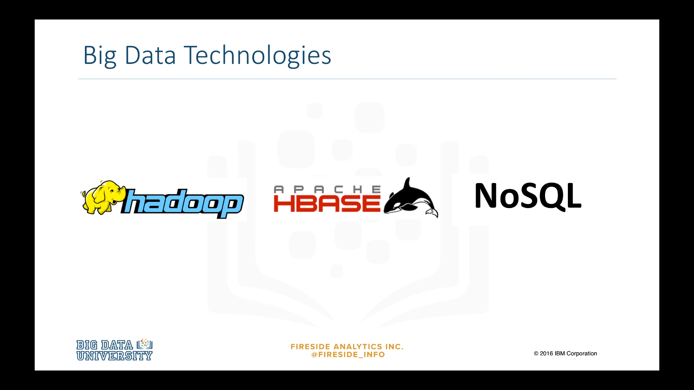

One trend making the Big Data revolution possible is the development of new software tools and database systems such as Hadoop, HBase, and NoSQL for large, un-structured data sets. 

### Big Data - Vendors
***

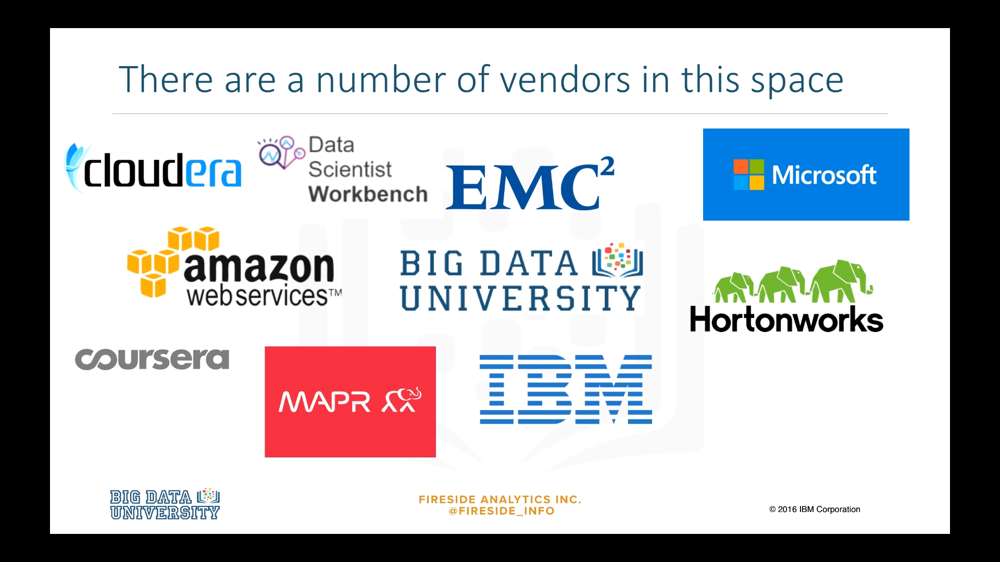

There are a number of vendors that offer Big Data processing tools and Big Data education. 

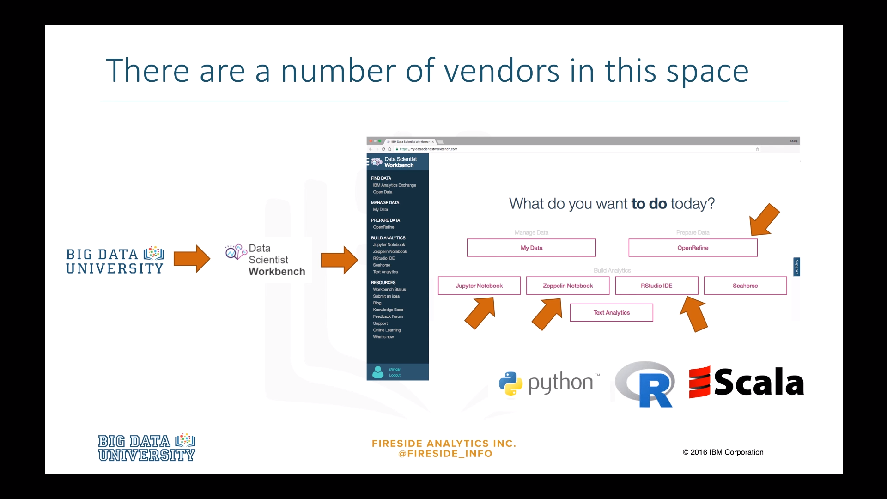

We'll start with IBM, who host Big Data University and Data Scientist Workbench. Data Scientist Workbench is a cloud hosted collection of open source tools such as OpenRefine, Jupyter Notebooks, Zeppelin Notebooks, and RStudio. It provides easy access to Spark, Hadoop, and a variety of other Big Data analytic engines, in addition to programming languages such as Python, R, and Scala. 

### Hadoop Framework
***

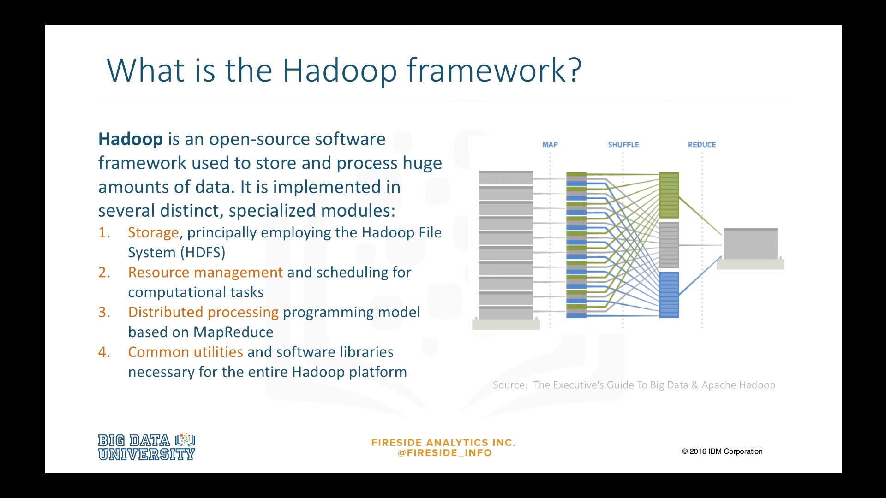

So what is the Hadoop framework? Hadoop is an open-source software framework used to store and process huge amounts of data. It is implemented in several distinct, specialized modules: 

* **Storage**, principally employing the Hadoop File System, or HDFS

* **Resource management** and scheduling for computational tasks

* **Distributed processing** programming models based on MapReduce

* **Common utilities** and software libraries necessary for the entire Hadoop platform. 

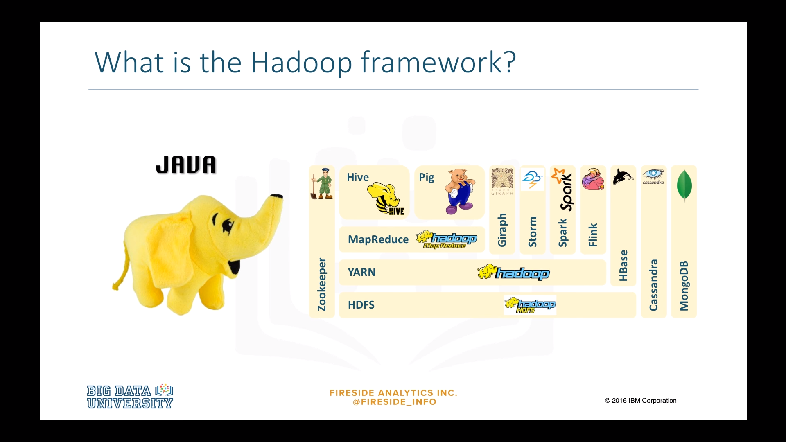

Hadoop is a framework **written in Java**, originally developed by **Doug Cutting** who named it after his son's toy elephant. Hadoop **uses Google's MapReduce technology** as its foundation. 

Let's review some of the terminology used in any Hadoop discussion. 

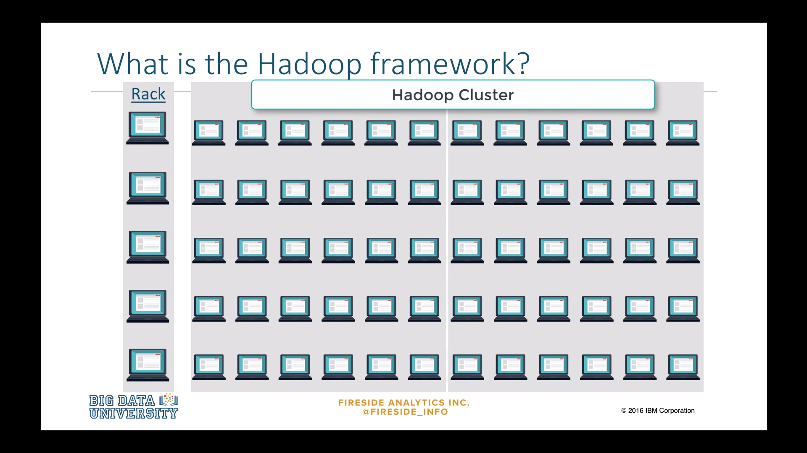

A **node** is simply a computer. This is typically non-enterprise, commodity hardware that contains data. So in this example, we have node one, then we can add more nodes such as node two, node three, and so on. This would be called a **rack**. A rack is a collection of 30 or 40 nodes that are physically stored close together and are all connected to the same network switch. Network bandwidth between any two nodes in a rack is greater than bandwidth between two nodes on different racks. The Hadoop Cluster is a collection of racks. 

IBM analytics defines Hadoop as follows, 

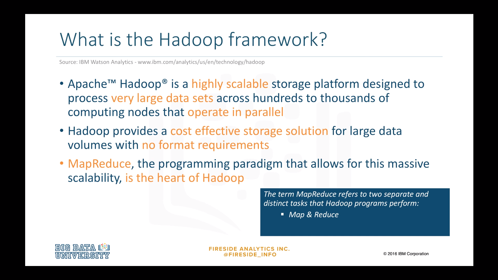

* Apache Hadoop is a highly scalable storage platform designed to process very large data sets across hundreds to thousands of computing nodes that operate in parallel. 

* It provides a cost effective storage solution for large data volumes with no format requirements. 

* MapReduce, the programming paradigm that allows for this massive scalability, is the heart of Hadoop. 

### Why Hadoop?
***

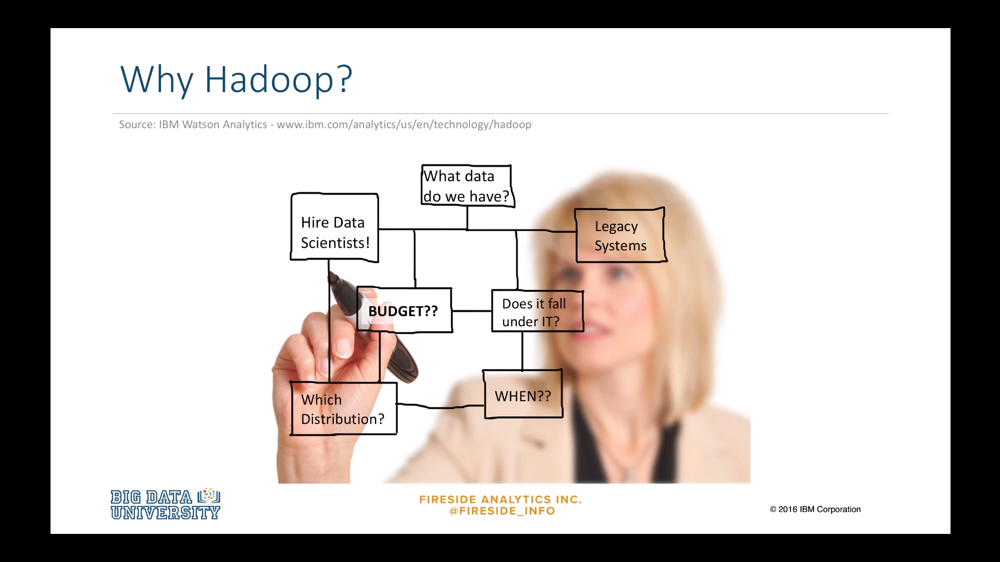

According to IBM analytics, some companies are delaying data opportunities because of organizational constraints. Others are not sure what distribution to choose and still others simply can't find time to mature their Big Data delivery due to the pressure of day to day business needs. 

### Hadoop Strategy
***

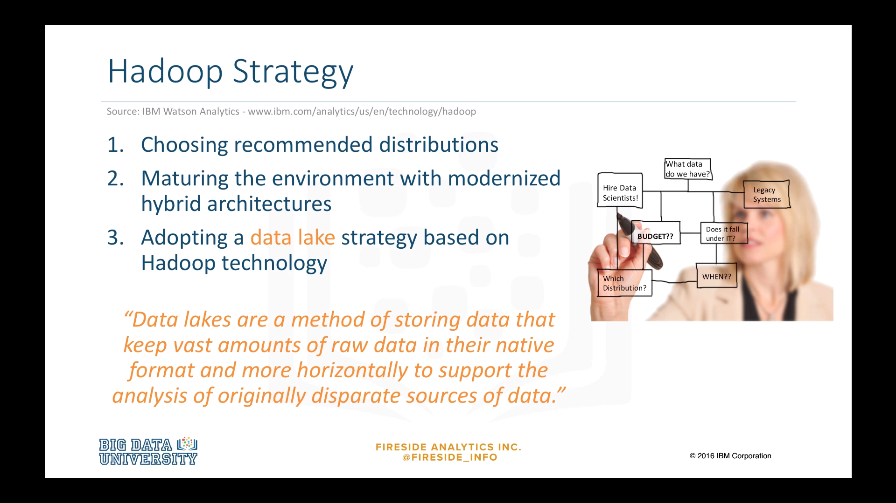

The smartest Hadoop strategies start with choosing recommended distributions, then maturing the environment with modernized hybrid architectures, and adopting a data lake strategy based on Hadoop technology. 

**Data lakes** are a method of storing data that keep vast amounts of raw data in their native format and more horizontally to support the analysis of originally disparate sources of data. 

### Data Warehouse
***

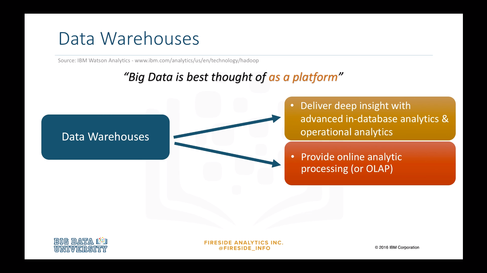

Big Data is best thought of as a platform rather than a specific set of software. Data Warehouses are part of a Big Data platform. They deliver deep insight with advanced in-database analytics and operational analytics. Data Warehouses provide online analytic processing, or OLAP. 

### Data Warehouse Modernization
***

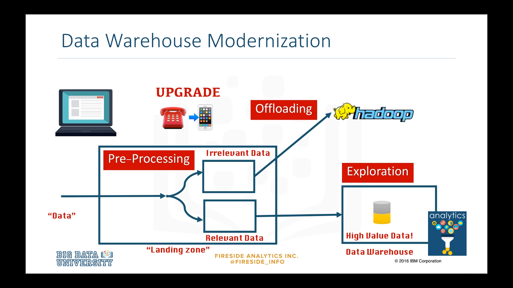

Data Warehouse Modernization, formerly known as Data Warehouse Augmentation, is about building on an existing Data Warehouse infrastructure leveraging Big Data technologies to augment its capabilities, essentially in upgrade. 

Given a set of data, there are three key types to Data Warehouse Modernization's. 

* **Pre-Processing**, using Big Data as a landing zone before determining what data should be moved to the Data Warehouse. It could be categorized as Irrelevant Data or Relevant Data, which would go to the Data Warehouse. 

* **Offloading**, moving infrequently accessed data from Data Warehouses into enterprise grade Hadoop. 

* **Exploration**, using big data capabilities to explore and discover new high value data from massive amounts of raw data and free up the Data Warehouse for more structured deep analytics.