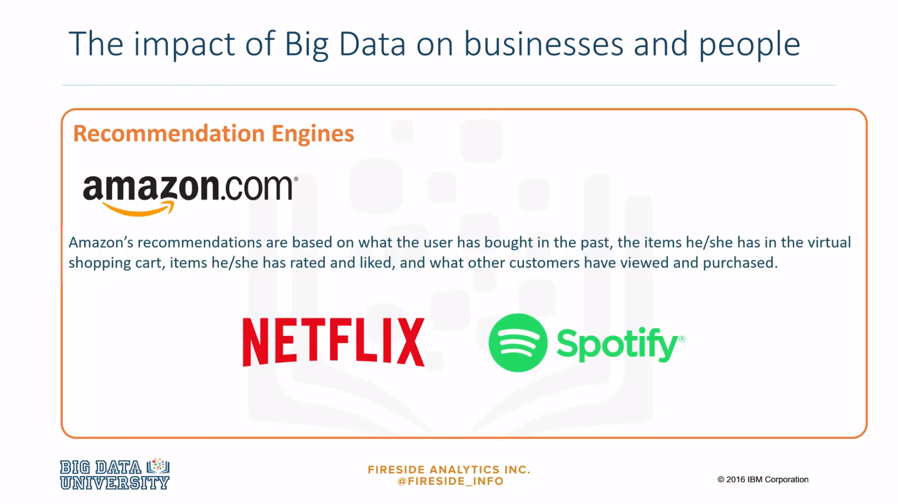
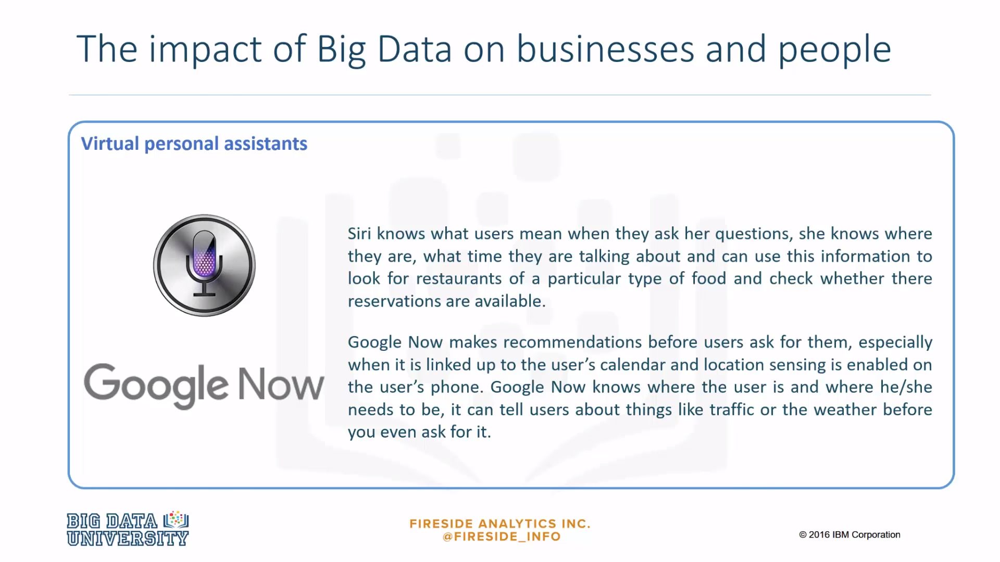
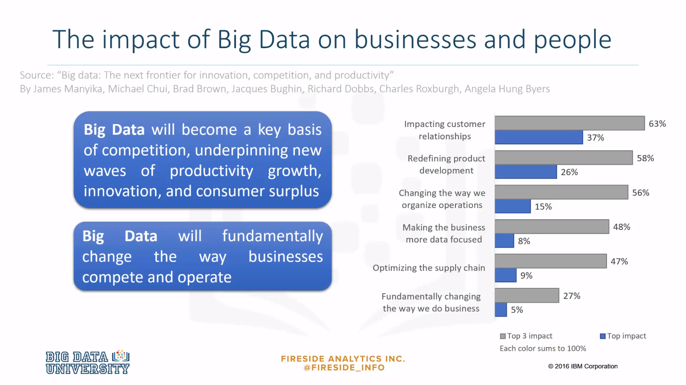
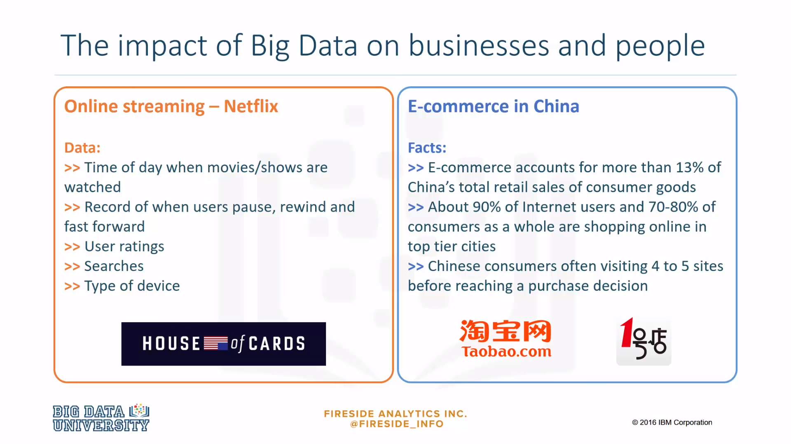
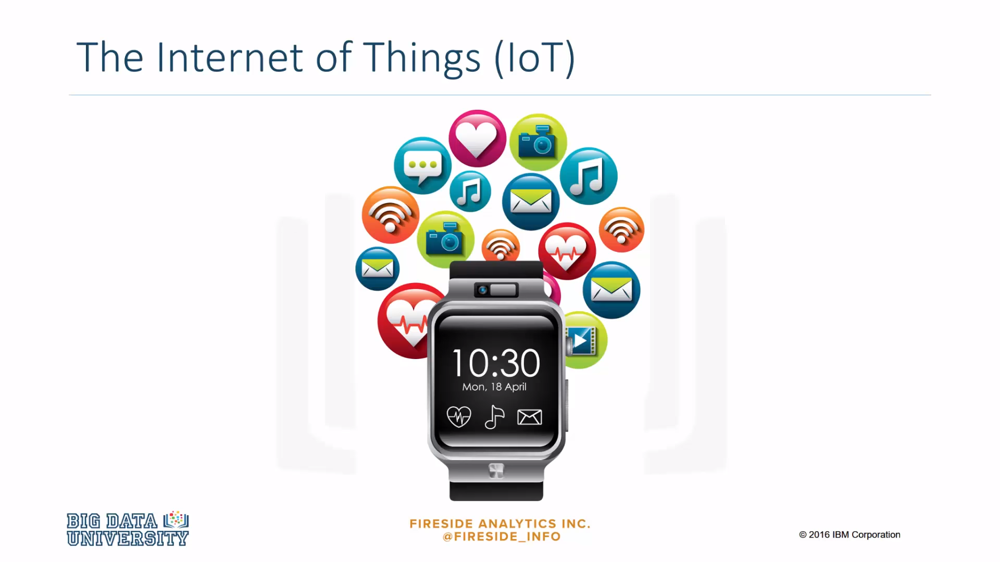

### Recommendation Engines
***

Many of us are generating and using big data without being aware that we are. How is big data impacting business and people? Have you ever searched for or bought a product on Amazon? Did you notice that Amazon started making recommendations related to the product you searched for? Recommendation engines are a common application of big data. Companies like Amazon, Netflix and Spotify use algorithms based on big data to make specific recommendations based on customer preferences and historical behavior. 

### Virtual Personal Assistants
***

Personal assistants like Siri on Apple devices use big data to devise answers to the infinite number of questions end users may ask. 

Google now makes recommendations based on the big data on a user's device. 

### Impact of Big Data on businesses and people

Now that we have an idea of how consumers are using big data, let's take a look at how big data is impacting business. In 2011, McKinsey & Company said that big data was going to become the key basis of competition supporting new waves of productivity growth and innovation. In 2013, UPS announced that it was using data from customers, drivers and vehicles in a new route guidance system aimed to save time, money and fuel. Initiatives like this one support the statement that big data will fundamentally change the way businesses compete and operate. 

### Netfix Example and E-commerce in China
***

How does a firm gain a competitive advantage? Have you ever heard of the **Netflix** show called **House of Cards**? The first season of the show was released in 2013 and it was an **immediate hit**. At the time, the New York Times reported that **Netflix executives knew that House of Cards would be a hit before they even filmed it**, but how do they know that? Big data. Netflix has a **lot of data**. Netflix knows the **time of day when movies are watched**. It **logs when users pause, rewind and fast forward**. It has **ratings from millions of users** as well as the **information on searches they make**. By looking at all these big data, Netflix knew many of its users had streamed the work of David Fincher and films featuring Kevin Spacey had always done well. And it knew that the British version of House of Cards had also done well. It also knew that people who liked Fincher also liked Spacey. All these information suggested that buying the series would be a good bet for the company, and in fact it was. In other words, thanks to big data, Netflix knows what people want before they do. 

Now let's review another example. Market saturation and selective customers will require Chinese e-commerce companies to make better use of big data in order to gain market share. Companies will have to persuade customers to shop more frequently, to make larger purchases and to buy from a broader array of online shopping categories. E-commerce players already have the tools to do this as digital shopping grows. Leading players are already using data to build models aimed at boosting retention rates and spending per customer based on e-commerce data. They have also started to adopt analytics backed pricing and promotional activities. 

### IoT
***

The Internet of Things refers to the exponential rise of connected devices. IoT suggests that many different types of data today products will be connected to a network or to the internet for example refrigerators, coffee machines or pillows. 

Another connection of IoT is called **wearables** and it refers to items of clothing or things we wear that are now connected. These items include Fitbits, Apple Watches or the new Nike running shoes that tie their own shoelaces.