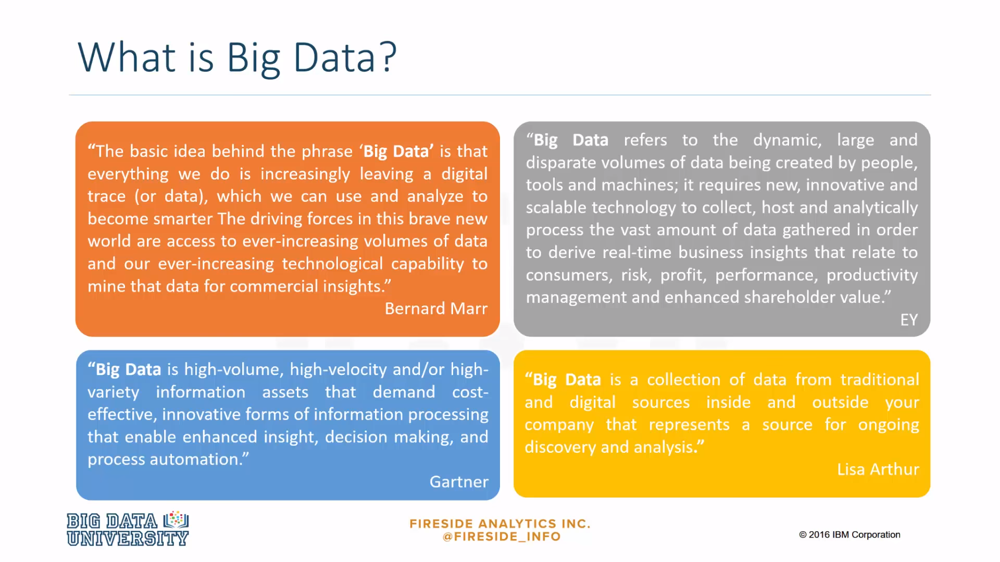
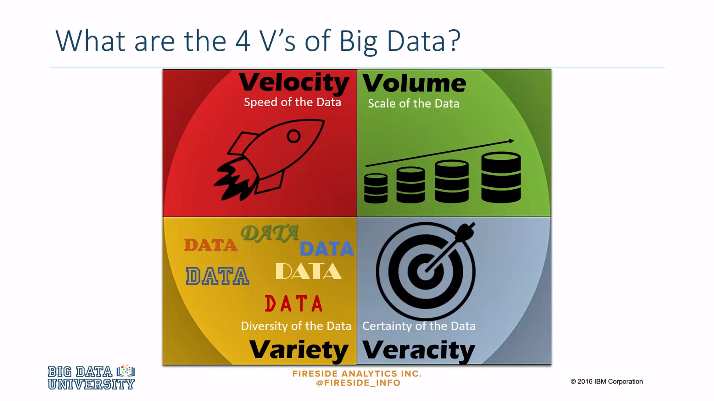
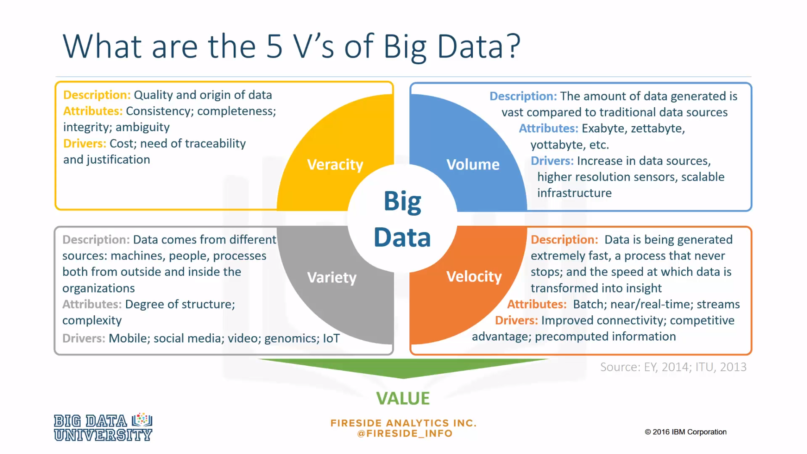
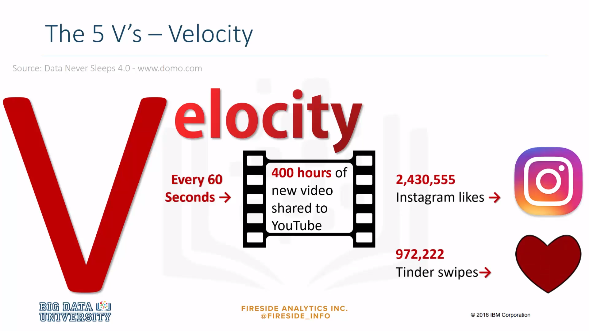
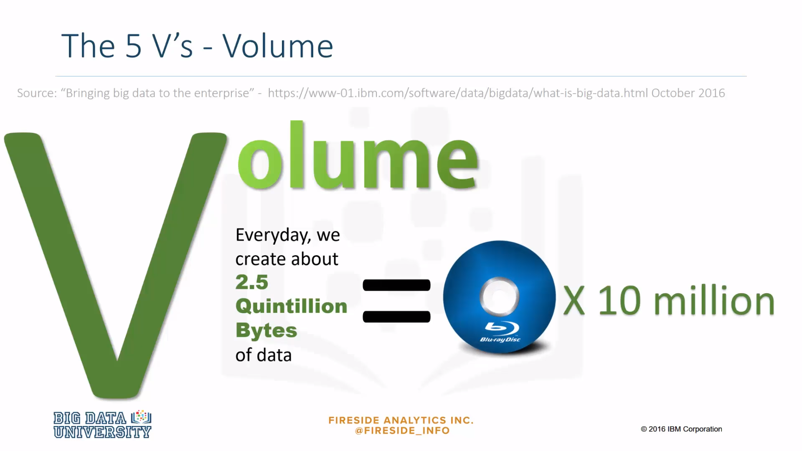
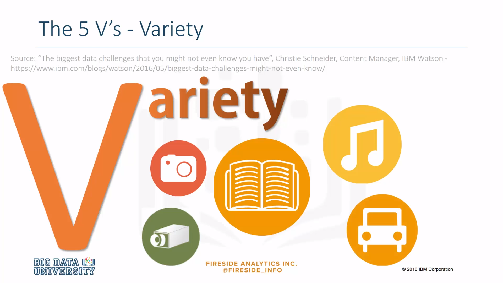
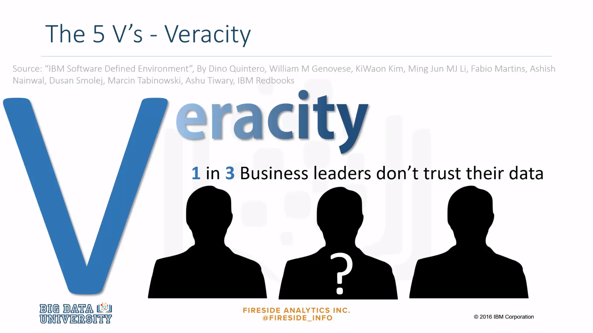
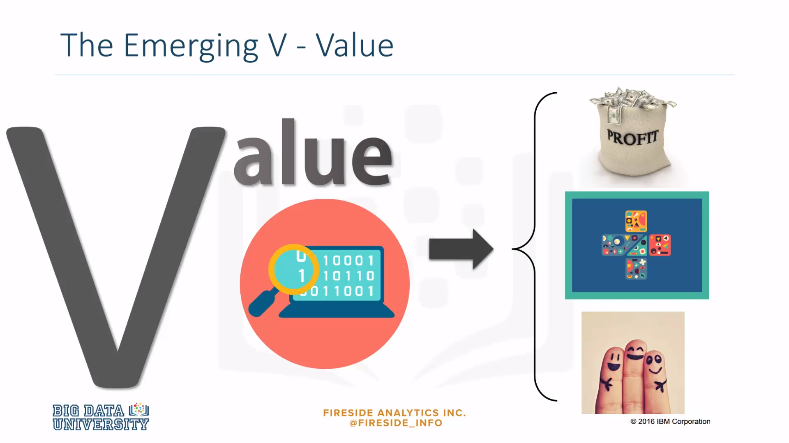

### Definition
***

**Bernard Marr** defines Big Data as the digital trace that we are generating in this digital era. This digital trace is made up of all the data that is captured when we use digital technology. The basic idea behind the phrase Big Data is that everything we do is increasingly leaving a digital trace which we can use and analyze to become smarter. The driving forces in this brave new world are access to ever-increasing volumes of data and our ever-increasing technological capability to mine that data for commercial insights. 

***

The research firm **Gartner**, defines Big Data as follows: Big Data is high-volume, high-velocity, and/or high-variety information assets that demand cost-effective, innovative forms of information processing that enable enhanced insight, decision making and process automation. 

***

**Ernst and Young** offers the following definition: Big Data refers to the dynamic, large and disparate volumes of data being created by people, tools and machines. It requires new, innovative, and scalable technology to collect, host and analytically process the vast amount of data gathered in order to derive real-time business insights that relate to consumers, risk, profit, performance, productivity management and enhanced shareholder value. 

***

**Lisa Arthur**, a Forbes contributor, defines Big Data as a collection of data from traditional and digital sources inside and outside a company that represent a source of ongoing discovery and analysis. 

### 4 V's
***

There is no one definition of Big Data, but there are certain elements that are common across the different definitions, such as velocity, volume, variety, and veracity. These are the V's of Big Data. 

**Velocity** is the speed of the data, or the speed at which data accumulates. 

***

**Volume** is the scale of the data, or the increase in the amount of data stored. 

***

**Variety** is the diversity of the data. We have structured data that fits neatly into rows and columns, or relational databases and unstructured data that is not organized in a pre-defined way, for example Tweets, blogposts, pictures, numbers, and even video data. 

***

**Veracity** is the conformity to facts and accuracy. With the large amount of data available, the debate rages on about the accuracy of data in the digital era. Is the information real, or is it false? Let's unpack the V's even further. 

### 5 V's
***

**Velocity** is the idea that data is being generated extremely fast, a process that never stops. Attributes include near or real-time streaming and local and cloud-based technologies that can process information very quickly. 

***

**Volume** is the amount of data generated. For example, exabytes, zettabytes, yottabytes, etc.. Drivers of volume are the increase in data sources, higher resolution sensors and scalable infrastructure. 

***

**Veracity** is the quality and origin of data. Attributes include consistency, completeness, integrity, and ambiguity. Drivers include cost, and the need for traceability. 

***

**Variety** is the idea that data comes from different sources, machines, people, processes, both internal and external to organizations. Attributes include the degree of structure and complexity and drivers are mobile technologies, social media, wearable technologies, geo technologies, video, and many, many more. 

And the last V is **value**. 

### Examples of V's
***
Let's look at some examples of the V's in action. 

**Velocity**: 

Every 60 seconds, hours of footage are uploaded to YouTube. This amount of data is generated every minute. So think about how much accumulates over hours, days, and in years. 

***

**Volume**: 

Every day we create approximately 2.5 quintillion bytes of data. That's 10 million Blu-ray DVD's every day. The world population is approximately seven billion people, and the vast majority of people are now using digital devices. These devices all generate, capture, and store data. And with more than one device, for example, mobile devices, desktop computers, laptops, et cetera, we're seeing even more data being produced. 

***

**Variety**: 

Let's think about the different types of data, text, pictures, and film. What about sound, health data from wearable devices, and many different types of data from devices connected to the internet of things. 

***

**Veracity**: 

80% of data is considered to be unstructured and we must devise ways to produce reliable and accurate insights. The data must be categorized, analyzed and visualized. 

***

The emerging V is **value**. 

This V refers to our ability and need to turn data into value. Value isn't just profit. It may be medical or social benefits, or customer, employee, or personal satisfaction. The main reasons for why people invest time to understand Big Data is to derive value from it.