# Git

### What is a Version Control System?
***

* Management of changes to any project (i.e. documents, web sites, or other relevent collections of things)

* These changes are called versions

* A user may have one latest copy of the version but he/she may revert back to older version, if needed.

* Here snapshot of all versions are properly documented and stored.

***

### So what track does a VCS keep?
***

* Its keeps a decription of 
	* What exactly was changed

	* When it was changed

***

There are basically two types of version control system:

* Central VCS

* Distributed VCS

***

### Difference between Central VCS and Distributed VCS
***

* **Central VCS**
	* In central version control system a central copy is maintain by all the contributors (developers). They have to directly make changes in the central copy.

	* In cast the central server crashes, no backup (local copy) is available

	* Example of Central VCS: Concurrent Version System, Apache Subversion (SVN)


* **Distributed VCS**
	* Here each developer have a local copy which he/she can maintain locally.

	* Even if the central server crashes, a backup is always available in the local server.

	* Example of Distributed VCS: Git

***

### Trend of few VCS (Git vs SVN vs CVS vs Mercurial)

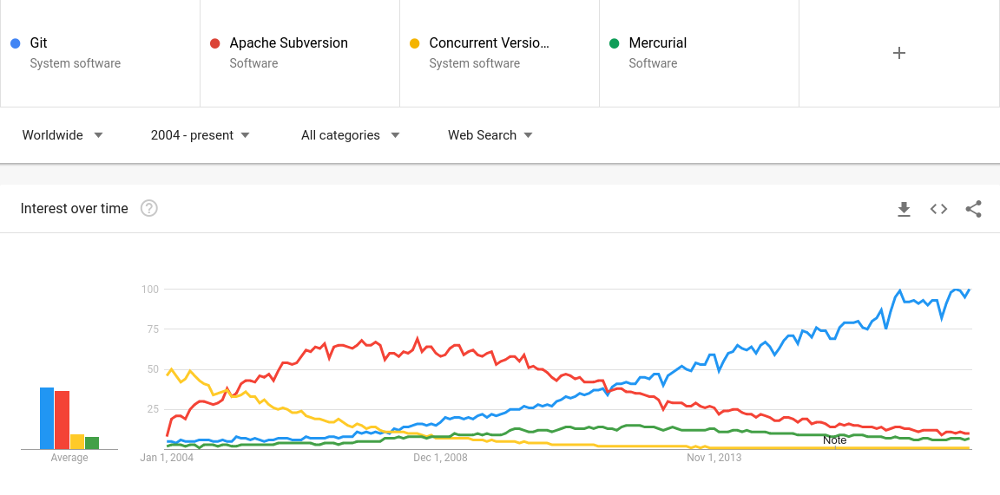


### What is Git?
***

* Git is a Distributed VCS

* It is Open Source

* Supports distributed non-linear workflows

* Used to handle everything from small to very large projects

* Features: Distruibuted, Compatible, Non-linear, Branching, Lightweight, Speed, Open Source, Reliable, Secure, Economical

* [More in official website](https://git-scm.com/)

***

### How to install Git?
***

Go to [download page](https://git-scm.com/downloads). Then download and install Git.

### Git commands

* check version

```bash
$ git --version
git version 2.7.4
```

After sucessfully installing Git you should also see the version as shown above. Now you first need to set up some **configuration values** so that other developers can know who checked the files overtime.

```bash
$ git config --global user.name "Your Name"
$ git config --global user.email "your-name@example.com"
```

These configuration values can be checked using:

```bash
$ git config --list
user.email=your-name@example.com
user.name=Your Name
push.default=simple
```

You can also go to the manual page for **git config**

```bash
$ git config --help
```

OR

```bash
$ git help config
```

For other verbs too you can either type

```bash
$ git <verb> --help
```

OR

```bash
$ git help <verb>
```

***

### What is Repository?
***
* It is like a directory where we keep our projects

* It can be on your local machine or some online hosting service like Github, GitLab etc.

* There are two types:
	* Central Repository

	* Local Repository

#### Central Repository
***
* Usually on remote server

* A team of developer works together

* Eclusive .git folder

#### Local Repository
***
* Resides in local machine

* There is only one admin

* .git folder inside project's root directory

***

So based on these repository there can be two scenerio in which one wants to use git.

* You want to track an existing project which is present in your local machine. Think of Local Repository.

OR

* You want contribute to an existing project which exist remotely. Think of Global Repository.

***

### Initialize a repository for existing code
***

For the first one what you need to do is just go your projects root directory and type

```bash
$ git init
```

This will create an local repository and if you do ```ls -a``` you can see the .git folder.

Example:

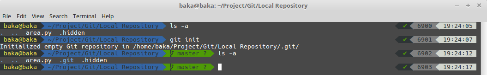

If in future you planned on not tracking the project you can always do:

```bash
$ git rm -r .git/
```

Now you can see the status of your repository by typing ```git status```. Basically ```git status``` tell you which files are added to indes and are ready to commit.

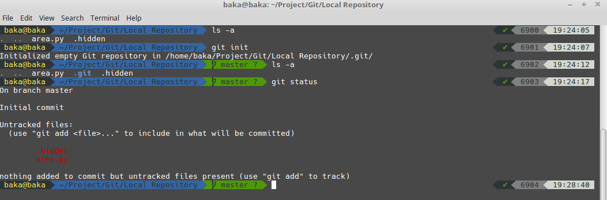

Now you can see we have one hidden file which we don't want others to track if in future we host this project in some hosting site like GitHub. So to ignore this file we need to add these kind of files in **.gitignore** file. Also we can use wildcard in .gitignore file.

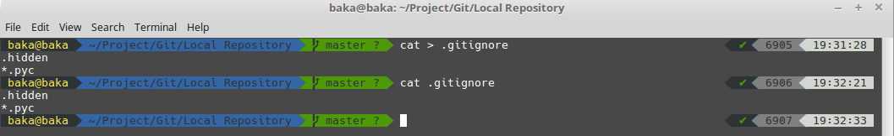

Now we can do a ```git status``` and see that we no longer have .hidden file in uncommitted status.


Right now our files are in **Working Directory**. From here we wants to add the files to the **Staging Area**.

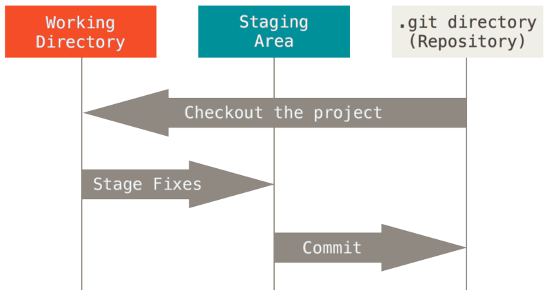

Staging area is the area where files are added before commiting.

So to add file to staging area we can use ```git add```

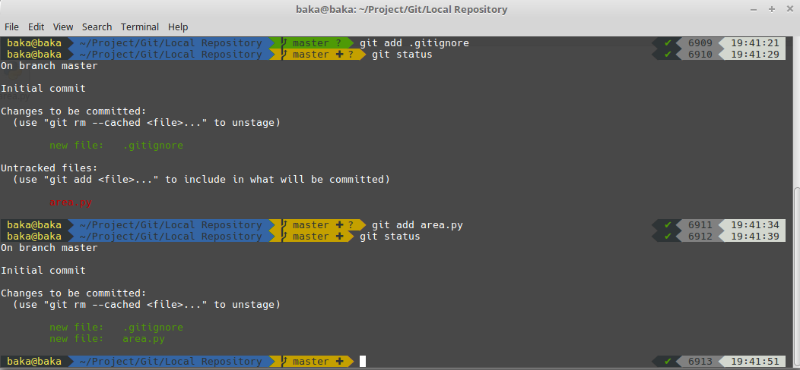

There's a shorthand to add every unstagged file in the staging area by typing ```git add -A``` or ```git add --all```.

If you want to remove a file from staging area you can use ```git reset```.

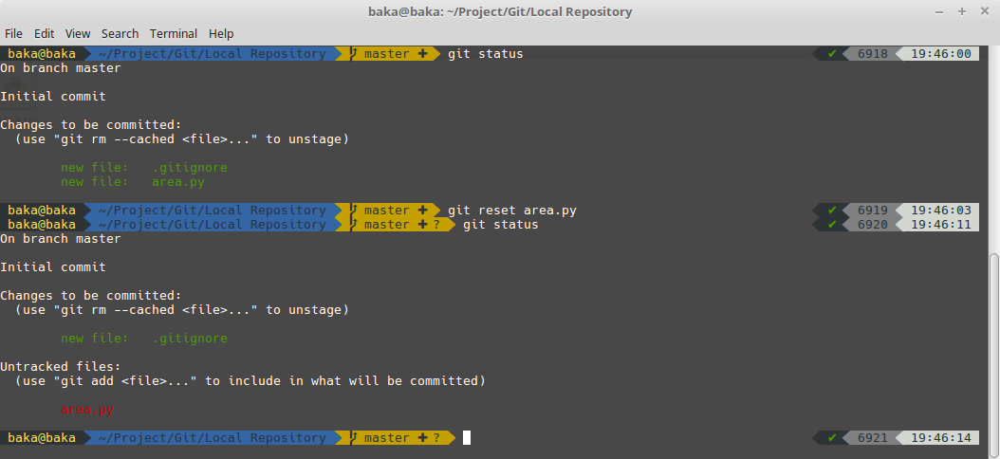

Now you can see that .gitignore is still in the staging area but area.py is not anymore in staging area.

If you want to remve all files from the staging area then you can simply type ```git reset``` without any extra arguments.

To commit the files in the staging are we can use ```git commit```

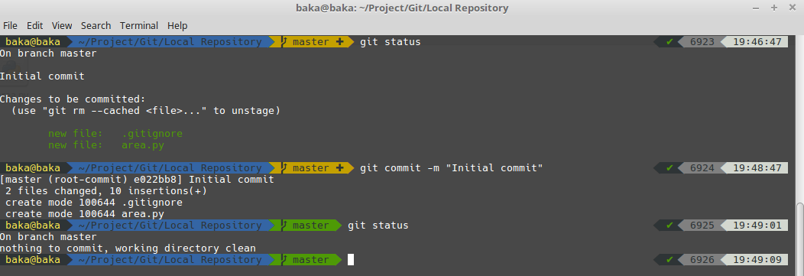

Here **-m** represent the message we want to pass i.e. the description of the commit. Since this is our first commit we can simply pass "Initial commit" as a message. But you should be specific to what commit you made in the future.

If we want to see the latest commits we made in our current repository we can use ```git log```. This give us the hash number of the commit, whcih is unique in itself, followed by the author and the time.

```
$ git log
commit e022bb89642511ec805c8d33d0e216e59ebfee58
Author: Your Name <your-name@example.com>
Date:   Mon Jun 11 19:49:01 2018 +0530

    Initial commit
```

***

Before going further let's see the structure of our directory.

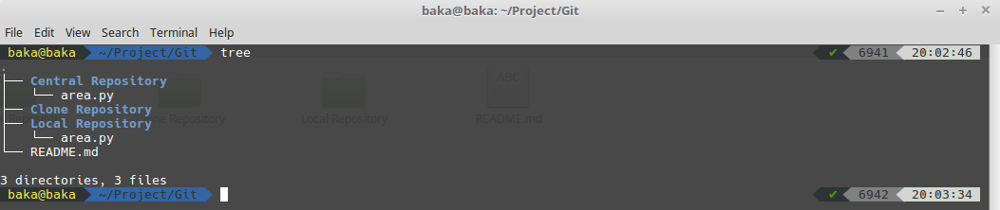

Here we have worked with **Local Repository**. Now we have one **Clone Repository** which is empty and a **Central Repository** which is same as the Local Repository. We are going to use Central Repository to show how to clone a remote repository.

### Cloning a remote repository
***

For cloning we use ```git clone```. The sytax is as follows:

```bash
$ git clone <url> <where you want to clone the repository>
```

Lets clone the **Central Repository** to **Clone Repository**. So first go to Clone Repository, then type:

```bash
$ git clone ../Central\ Repository/.git . 
```

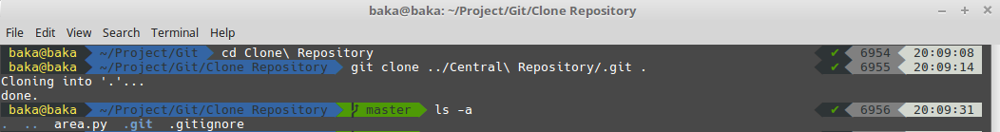

We can check the information about the remote repository using ```git remote -v``` and ```git branch -a```

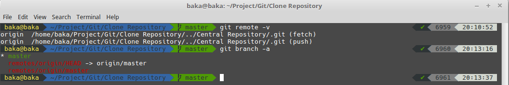

Now let's make some change to the **area.py** file. And let's see how we will make a push to remote repository (i.e. push the changes).

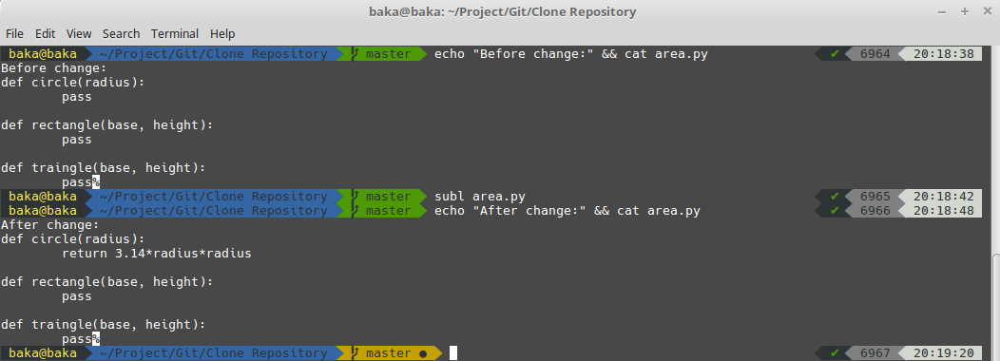

To check the diferrence we can use ```git diff```.

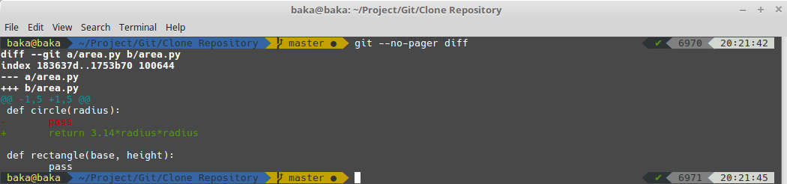

Now I used something like **--no-pager** to just show the output in terminal itself (it by default shows it in **less** or **vi** i.e. interactive mode).

The important thing to notice is we have
```diff
- pass
+ return 3.14*radius*radius
```
The line in red is what we **removed** and the line in green is what we **added**.

Now let's commit this change locally.

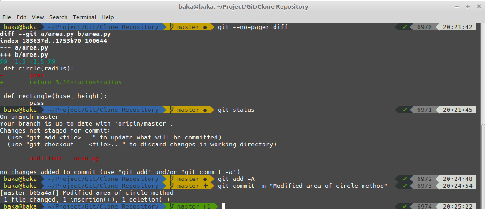

To commit these changes in remote repository first we need to do a ```git pull``` and followed by ```git push```. It should be noted that when working with remote repository you need to do a ```git pull``` **before** doing ```git push``` because there might be some changes in the **remote repository** made by other developers while we are making changes to our **local repository**.

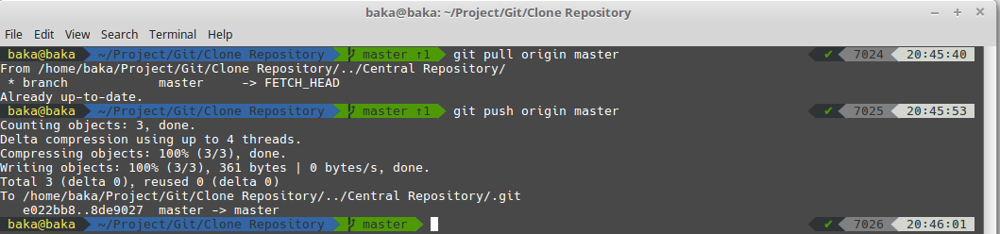

### Common Workflow

* Normally developer have branches that points to specific commit.

* Say for example you could have a different branch for a particular issue. And when you want to have those changes in master branch you just merge that branch with master.

* We generally have two types of branching:
	* Local branches
	* Remote-tracking branches

Let's make a seperate branch for changing rectangle area method using ```git branch <branch name>```.

To see in whcih branch we are currently at we can use ```git branch```

To change the branch to any local branch we can use ```git checkout <branch name>```

So let's do all that:

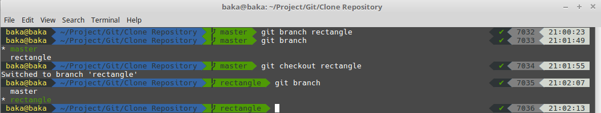

Now let's make change to the **area.py** file and commit it in the local **rectangle** branch and finally push it.

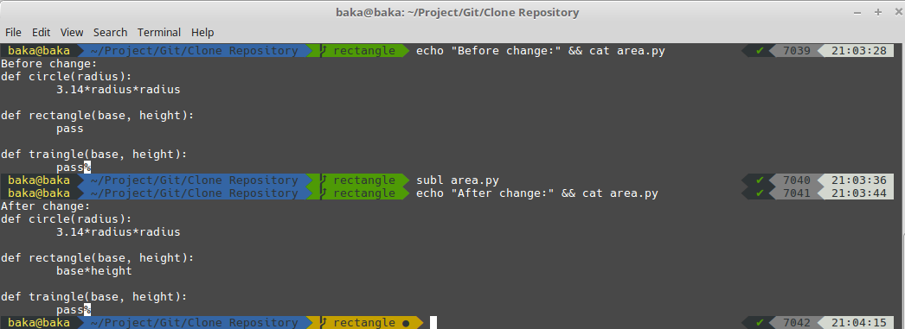

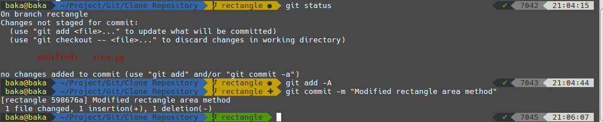

To list all the branches we can use ```git branch -a```.

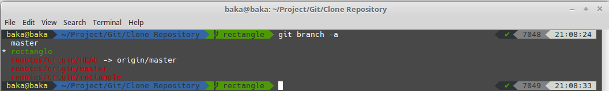

* What we want to do now is:
	* move to the **local master branch**.

	* pull all changes from **remote master branch.**

	* merge **local master branch** with the **local rectangle branch**.

	* push the changes in **remote master branch**.

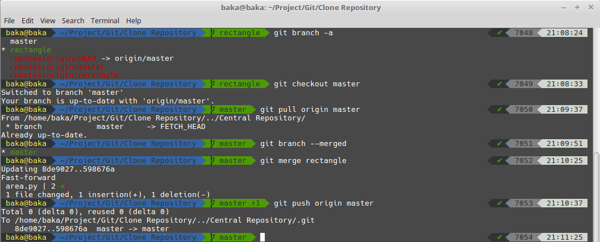

Now since the work of the rectangle branch is finished, we want to delete that branch using ```git branch -d <branch name>```.

Also we want to delete the remote rectangle branch. For that we can use ```git push origin --delete <branch name>```

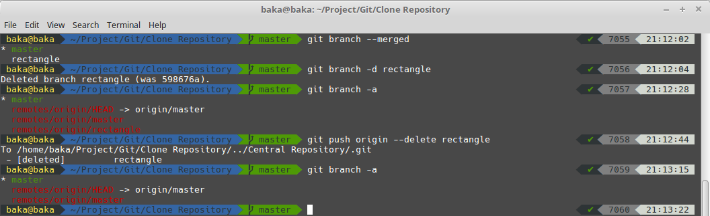

Finally we can have a look at our local file and remote file.

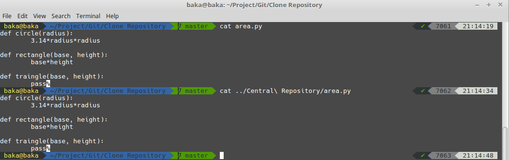

We can see that both the file are same, i.e. the changes we made locally are reflected remotely.

So this is a overview of how to use Git to work with local and remote repository.

Finally here's a diagram which show the basic flow.

