# Theory of Computation
***

### Definition
***
Study of mathematical machine or system, often called automata (deals with computational problem).

### Theory of Formal Languages
***
In mathematics and computer science a formal language is set of **strings** of **symbol** together with a set of rules (**grammar**).

So we need to:
**Grammar** ---(to generate)---> **Language** ---(accepted by)---> **Machine(Automata)**

### Terminology
***
* **Symbol**: Basic building blocks which can be any character as token.

	example: In english alphabet we 26 small (a to z) and 26 capital (A to Z) symbols (letters).

	* English have 26 symbols. More symbols can generate more words, so we can express ourself in a better way.

	* We could have language for say fan with just 2 symbols. One for **ON** and one for **OFF**. It all depends on the complexity of the problem.

	* In formal automata we could have only two symbols like **a** and **b** or say  **0** or **1**.

* **Alphabet**: **Finite non-empty set** of symbols (set of letters).

	example: In english we have {a, b, c, ..., z}

	In formal language we denotes alphabet with **Σ**. So we can have Alphabet with teo symbol, **Σ = {0, 1}** or **Σ = {a, b}**

* **String**: Finite sequence of symbols.

	example: In english **car** is a string. It is already pre-difined and compiled in a dictionary (Oxford Dictionary for example).

* **Language**: Set of a string.

	In Formal language we can have **Language L = {001, 110}** build by **strings 001** and **110** which is built by **alphabet Σ = {0, 1}** which is built from two **symbols 0** and **1**.

### Basic operations on strings
***
Strings are basically denoted by Capital Letter (English), usaually W.

* Length of String: It is denoted by **|W|**.

* Null is a string of length 0 and is denoted by **ϵ**. So |ϵ| = 0.

* Concatenation of strings. 
	Say we have 2 strings **W1 = 'abc'** and **W2 = 'ac'**.
	So concatenation of strings **W1** and **W2** is denoted by **W1.W2 = abcac**.
	* |W1| + |W2| = |W1.W2|
	* W1.W2 ≠ W2.W1 but W.ϵ = ϵ.W = W

* Reverse of a string: It is denoted by **WR**.
	* |W| = |WR|

* Prefix and Sufix: Set of substring of W from starting and ending position respectively.
	Say W = abaa
	Now prefix of W denoted by **P(W)** = {ϵ, a, ab, aba, abaa}
	Sufix of W denoted by **S(W)** = {ϵ, a, aa, baa, abaa}

* Substring: As it sounds. It's a substring. Sequence is maintain
	Say W = abbbaca

	abb -> is a substring
	bab -> is not a substring
	cab -> is not a substring
	bbb -> is a substring

	Say we have a string where all the symbols are unique: **GATE**

	So how many substring we can have?

	| Substring(↓)/Size(→) | 0 | 1 | 2 | 3 | 4 |
	|:-------------:|:-------------:|:-------------:|:-------------:|:-------------:|:-------------:|
	| → | ϵ | G | GA | GAT | GATE |
	| → | - | A | AT | ATE | - |
	| → | - | T | TE | - | - |
	| → | - | E | - | - | - |

	That's equals to 11.

	This can be calculated by **n\*(n+1)/2 + 1**, where |W| = n

### Kleene Closure
***
Denoted by Σ\*. The set Σ\* is the infinite set of all possible strings of all possible lengths over Σ including ϵ.

Let Σ = {a, b}

Now,
Σ0 = {ϵ}

Σ1 = {a, b}

Σ2 = {aa, ab, ba, bb}

:

:

Σk = {W | |W| = k}

:

:

Σ∞ = {W | |W| = ∞}

Union of all these sets is Σ\*.

Also we have,

### Grammar, Language, Automata
***
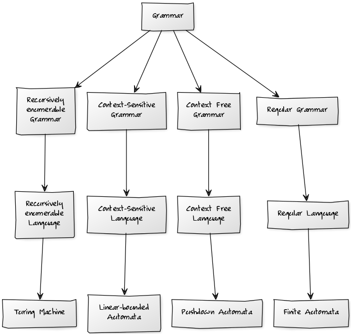

### Finite Automata
***
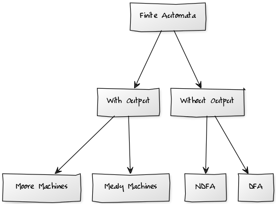

### Deterministic Finite Automata
***

DFA = {Q, q0, ∑, F, δ}

Q : Finite set of states.

* It is represented by circle. It is always require to be non-empty.
* We call it finite because we don't use any external memory to remember something. We change state to remember something(symbol).

q0 : Initial state.

* Every finite automata will always have only 1 Initial state.
* It can be named anything apart from q0.
* It have an incoming arrow comming from nowhere.

∑ : set of Input Symbols.

* You require at least 1 symbol. 
* It cannot be infinite.

F : set of Final States.

* A DFA can have more than one final state.
* There can also be a DFA with no Final state. In that case it accept empty langauge.
* Every state can be a Final state. In that case the DFA accept Universal Language.
* It is denoted by double circle.

δ : Transition Function.

It is define as δ: Qx∑->Q

It implies that on some state in set Q if we have some symbol from set ∑, then we transit to some other state present in Q.

Let's take an example.

A DFA which accepts string starting with **a**.

Q = {A, B, C}

q0 = A

∑ = {a, b} 

F = {B}

δ : 
Here we have trasitions:
* For **A** getting **a** we go to **B**.
* For **A** getting **b** we go to **C**.
* For **B** getting **a**, **b** we go to **B**.
* For **C** getting **a**, **b** we go to **C**.

The state diagram of the following is:

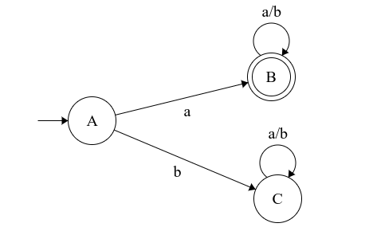

DFA -> **For every state for every symbol we must have only one transition.**

We can also draw a transition table:

| State(↓)/Symbols(→) | a | b |
|:-------------:|:-------------:|:-------------:|
| A | B | C |
| B | B | B |
| C | C | C | 

If for any string The machine ends on a finale state then that string is accepted.

You can play arround with this [here](http://madebyevan.com/fsm/).

### DFA Designing
***

* **Design a MDFA over ∑ = {a, b} such that every string accepted must start with W**

	The way to design MDFA starting with a string is:
	* Take the **smallest string possible** and draw the state diagram.
	* After that make the machine **complete**. For every string that is never going to get accepted we have to have a **dead state** for the same.
	
	***
	
	1. *W = 'a'*

	The language would be L = {a, aa, ab, aaa, ...}

	Smallest string possible is 'a'. Draw a state diagram which accepts 'a'.

	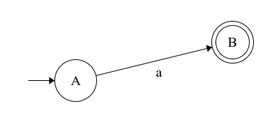

	Now complete the machine. We need to have a transition for 'b' from state A. But every string which starts with 'b' should be rejected so Draw a dead state for the same. And for dead state C we keep on looping on recieving 'a' and 'b' as string starts with 'b' should be rejected.

	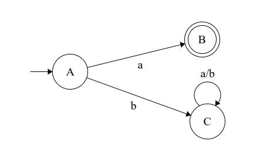

	Now we need to have transition for 'a' and 'b' from B. Since after 'a' we can have any number of combination of 'a' and 'b', therefore we can loop on B (Also it's a final state).

	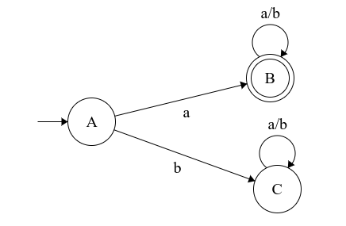
	
	***
	
	2. *W = 'ba'*

	The language would be L = {ba, baa, bab, baaa, ...}

	Smallest string possible is 'ba'. Draw a state diagram which accepts 'ba'.

	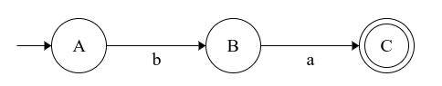

	Now complete the machine. We need to have a transition for 'a' from state A. But every string which starts with 'a' should be rejected so Draw a dead state for the same. ALso we need a transition for 'b' from state B. Now if string starts with 'bb' it should be rejected hence the transition of 'b' from B will be in dead state.

	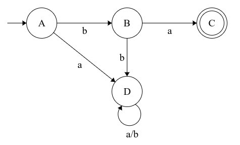

	Now to just complete the machine we have transition for 'a' and 'b' from state C (final state) to itself.

	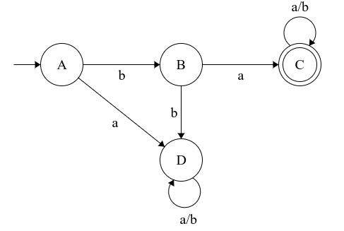
	
	***
	
	3. *W = 'abb'*

	DFA for the language will be:

	

	**NUMBER OF STATES IN DFA STARTING WITH A SUBSTRING OF LENGTH 'n' IS 'n+2'**

	i.e. A DFA starting with substring W where |W| = n,
	number of states = n + 2 
	
	***

* **Design a MDFA over ∑ = {a, b} such that every string accepted must ends with W**

	The way to design MDFA starting with a string is:
	* Take the **smallest string possible** and draw the state diagram.
	* After that make the machine **complete**. Here we don't have any dead state. All we do is go back or loop in the same state.
	
	***
	
	1. *W = 'bb'*

	The language would be L = {bb, abb, bbb, abbb, aabb, ...}

	Smallest string possible is 'bb'. Draw a state diagram which accepts 'bb'.

	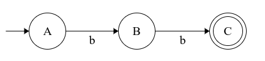

	Now complete the machine. We need to have a transition for 'a' from state A. Now it's possible to have any number of 'a' followed by 'bb'. So we can loop on A (It should be note that A is the state which counts 'bb').

	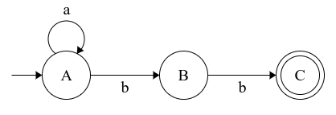

	If we have 'a' on B we have to go back to state A since there is a possibility of having 'bb' followed after that.

	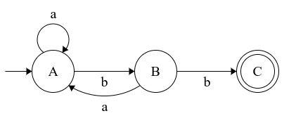

	Again if we have 'b' in C we could just loop at C and if we have 'a' on C we have to go back to A (A counts 'bb'), since there is a possibility of having 'bb' following that. If we have 'b' at C we can just loop in C.

	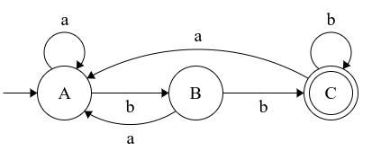

	Similarly we can design other DFA.
	
	***
	
	2. *W = 'ab'*

	The language would be L = {ab, aab, bab, abab, aaab, ...}

	Smallest string possible is 'ab'. Draw a state diagram which accepts 'ab'.

	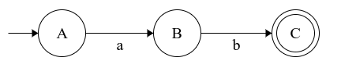

	Now complete the machine. We need to have a transition for 'b' from state A. Now it's possible to have any number of 'b' followed by 'ab'. So we can loop on A (It should be note that A is the state which counts 'ab').

	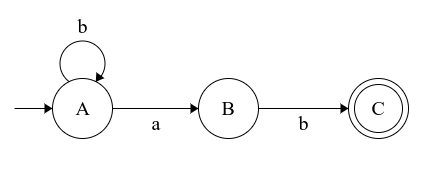

	If we have 'a' on B we can loop at B because after that we can transit with one b and have a string which ends with 'ab'.

	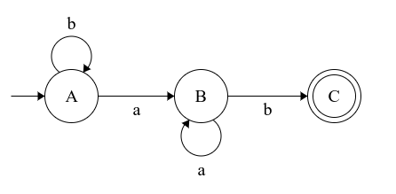

	If we have 'b' on C we have to go back to A since the pattern is destroyed (eg. abb).

	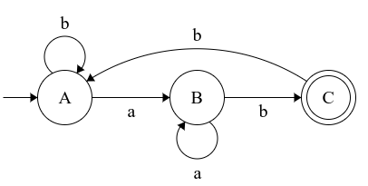

	Finally if we have 'a' on C we can just go back 1 step i.e. to state B. since then we have a chance of getting 'b', which is followed by the 'a' on C. Therefore that string ends with 'ab'.

	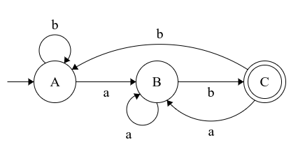
	
	***
	
	3. *W = 'bab'*

	We can similarly draw state diagram for the following language:

	L = {bab, abab, bbab, aabab, ...}

	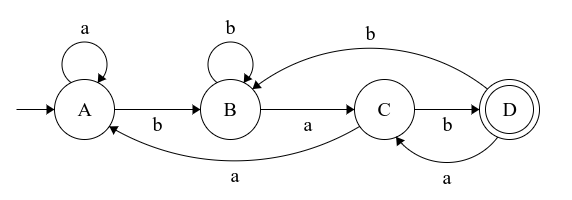

	**NUMBER OF STATES IN DFA ENDING WITH A SUBSTRING OF LENGTH 'n' IS 'n+1'**

	i.e. A DFA ending with substring W where |W| = n,
	number of states = n + 1

	This is because in this case we don't require a dead state. 
	
	***

* **Design a MDFA over ∑ = {a, b} such that every string accepted must contains a substring W**

	The way to design MDFA starting with a string is:
	* Take the **smallest string possible** and draw the state diagram.
	* After that make the machine **complete**. Here we don't have any dead state. All we do is go back or loop in the same state.

	1. *W = 'bb'*

	The language would be L = {bb, abb, bbba, abba, aabba, ...}

	Smallest string possible is 'bb'. Draw a state diagram which accepts 'bb'.

	

	Now complete the machine. We need to have a transition for 'a' from state A. Now it's possible to have any number of 'a' followed by 'bb'. So we can loop on A (It should be note that A is the state which counts 'bb').

	

	If we have 'a' on B we have to go back to state A since there is a possibility of having 'bb' followed after that.

	

	Finally when we have made sure we have 'bb' (since if we are in C, we have encounter 'bb'), we can just loop in C if we have 'a' or 'c'.

	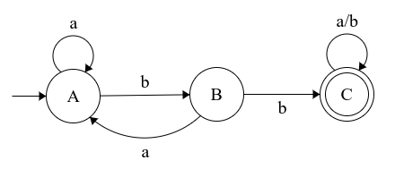

	Similarly we can design other DFA.

	***
	
	2. *W = 'ab'*

	The language would be L = {ab, aabb, babb, ababa, aaaba, ...}

	Smallest string possible is 'ab'. Draw a state diagram which accepts 'ab'.

	

	Now complete the machine. We need to have a transition for 'b' from state A. Now it's possible to have any number of 'b' followed by 'ab'. So we can loop on A (It should be note that A is the state which counts 'ab').

	

	If we have 'a' on B we can loop at B because after that we can transit with one b and have a string which ends with 'ab'.

	

	Since when we reached the final state, it is sure that we have encounted the substring 'ab'. Therefore we can just loop on final state on having either 'a' or 'b'.

	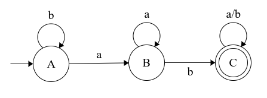

	***
	
	3. *W = 'bab'*

	We can similarly draw state diagram for the following language:

	L = {bab, ababa, bbabb, aababb, ...}

	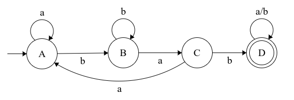

	**NUMBER OF STATES IN DFA CONTAINING A SUBSTRING OF LENGTH 'n' IS 'n+1'**

	i.e. A DFA containing a substring W where |W| = n,
	number of states = n + 1

	This is because in this case we don't require a dead state.
	Also it's worth noting that once we reached the final state we can just loop at getting any symbols in the alphabet set.
	
	***

* **Containing Substring Summary**
	***
	If we have a substring W such that |W| = n, then Number of 

	|| Starting (i.e. Wx) | Ending (i.e. xW) | Containing (i.e. xWx) |
	| :-----------: | :-----------: | :-----------: | -----------: |
	| Number of States →| n + 2 | n + 1 | n + 1 |

	***

* **Design a MDFA over ∑ = {a, b} such that every string starts and ends with 'a'**

	***
	The language would be L = {a, aa, aba, abaa, aaba, ...}

	Smallest string possible is 'a'. Draw a state diagram which accepts 'a'.

	

	Now we have to complete the DFA. We know that if the string starts with 'b', then it should be rejected. So if we have 'b' on A, then we have to transit to a dead state.

	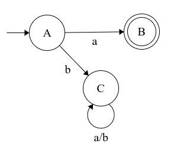

	One thing that should be noted here is **we should never come back to a state from which we have a dead state.** That is whatever the case, we should never come back to state A.

	If we get a 'b' on B, then we have to go to a new state (why? read over bold text). In the new state we could just loop until we get an 'a', in which we have to come back to B again.

	So the final DFA is:

	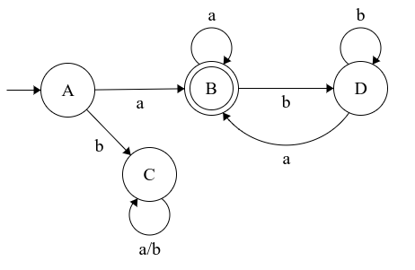

	***

* **Design a MDFA over ∑ = {a, b} such that every string starts and ends with same symbols**

	NOTE: We have two symbol 'a' and 'b'.

	In this case we **require more than one final state**.

	The language would be L = {a, b, aa, aba, bab, abaa, bbab, aaba, ...}

	So the smallest string here is either a or b. That's why we need two final state.

	The initial diagram may look like:

	

	Now for string starting and ending with a, we can use the same logic as we used previously and have an extra state which loops in 'b' until there is an 'a', and if there is any 'a', then it comes back to B.

	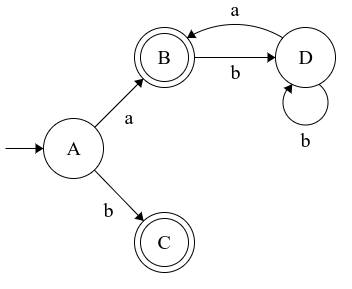

	We can do the same thing for strings starting and ending with 'b'.

	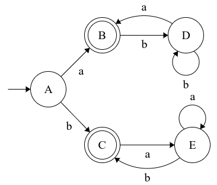

	***

* **Design a MDFA over ∑ = {a, b} such that every string starts and ends with different symbols**

	***
	The language would be L = {ab, ba, aab, abab, baba, abaab, bbaba, aabab, ...}

	Here the smallest strings are 'ab' and 'ba'.

	So we can start with the initial state and create DFA that accept ab on one part and then DFA that accepts ba.

	Then we can just complete the machine.

	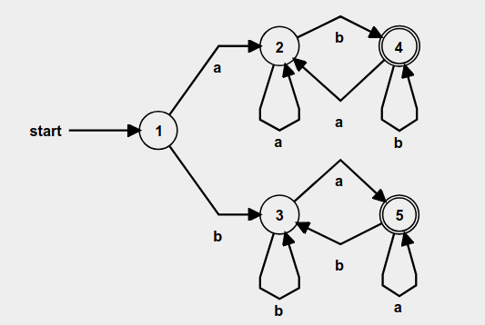
	
	***

* **Design a MDFA over ∑ = {a, b} such that every string starts with 'aa' or 'bb'**
	
	***

	For this first we need to accept smallest strings i.e. 'aa' and 'bb'.

	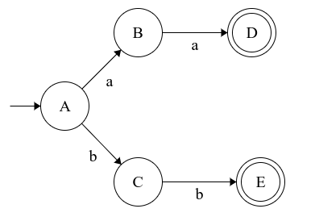

	After this we can complete the DFA. If we get 'b' on B then we have to go to a dead state.

	Also same can be said for 'a' in C.

	After reaching the final state we can loop for 'a' and 'b' as we need the machine to accept the strings which *starts* with 'aa' or 'bb'.

	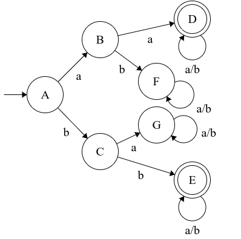

	This DFA can be minimized further. Instead of having two dead state (F and G) we could merge the two dead state and have a single dead state.

	Also since both are final state have same characteristics (loop at 'a' or 'b'), therefore we can merge the final states too.

	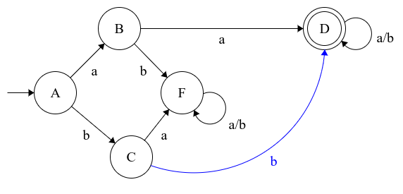

	***

* **Design a MDFA over ∑ = {a, b} such that every string ends with 'aa' or 'bb'**

	***

	The steps are actually same as above.

	The final DFA will look like:

	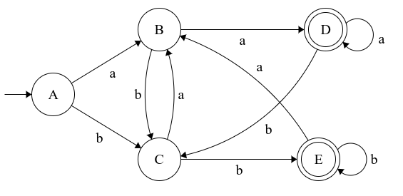

	***

* **Design a MDFA over ∑ = {a, b} such that every string accepted must be**
	
	***

	1. |W| = 2

	In this case we are not concert about the symbol. We just want to accept string which are of length 2.

	Here the language is , L ={aa, ab, ba, bb}

	So in the initial state we can go to next state irrespectively whether we have 'a' or 'b'

	Also from second state we can tarnsit on either getting 'a' or 'b'.

	The third state is final state, but if we recieve any other symbol, that means the string is greater than 2 in length, hence we need to reject it and for that we need a dead state.

	The final DFA looks like this:

	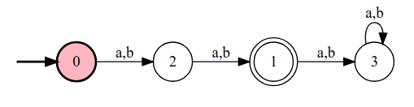

	***

	2. |W| <= 2

	Here the language is , L = {ϵ, a, b, aa, ab, ba, bb}

	Here we have to accept all the string of length less than or equal to 2 (it includes null string).

	So the DFA will look similar to the previous one but with the 1st, 2nd and 3rd state as final state.

	

	***

	3. |W| >= 2

	Here the language is , L = {aa, ab, ba, bb, aaa, aab, ...}

	This one is also self explainatory. But instead of having a dead state we will just loop in the final state as any string of length 2 or greater is acceptable.

	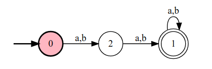

	***

* **Design a MDFA over ∑ = {a, b} such that every string accepted must be**

	***

	1. |W|a = 2

	It say length of a is 2. That means the number of 'a' must be two (not needed consicutive). We can have any number of b.

	Here the language is , L ={aa, aab, baa, baab, ...}

	The smallest string possible is 'aa'. So first let's draw a states for the same.

	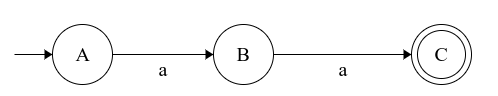

	If we have 'b' at A, B or C we can just loop. This is because it doesn't matter how many 'b' we have.

	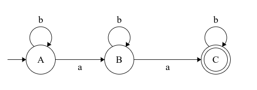

	Now the only case is if we have another 'a' at C then we have to go to a dead state as then number of 'a' at that case is greater than 2.

	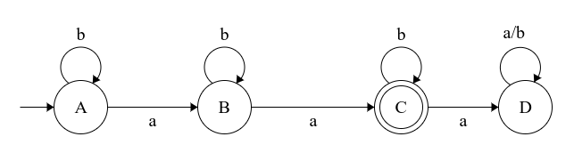

	2. |W|a <= 2

	Here the only thing we need to  consider is we can accept 0, 1 or 2 'a'. Therefore the 1st and 2nd state will be final state too.

	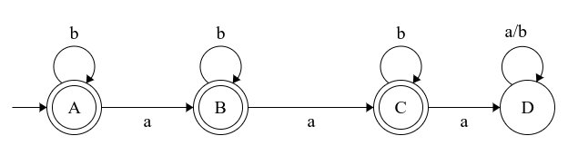

	3. |W|a >= 2

	Here we can just loop in final state as when we are final state we have encounter 2 a's already.

	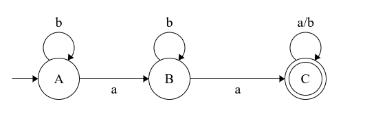

	***

* **Design a MDFA over ∑ = {a, b} such that every string accepted must be**

	***

	1. |W| = 2(mod 3)

	**r(mod n)** means if we divide something with **n** then the remainder must be **r**.

	So 2(mod 3) means we can have a length of string as 2, 5, 8, 11, ...

	The trick is to draw the **number of state equal to n**. Here we will have 3 states, and from each state we will have transition to another state on 'a' or 'b'.

	This is because we can have only 3 remainder when something is divided to 3 (i.e. 0, 1, and 2). These three remainder can be represented using 3 states.

	Finally we can make the one with remainder 2 as final state.

	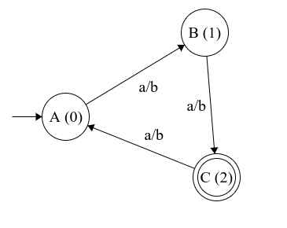

	Similarly we can draw state diagram for other.

	2. |W| = 1(mod 4)

	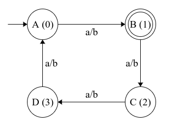

	3. |W|a = 2(mod 4)

	This is a bit different as we have to only consider 'a'. So what we can do is just loop everytime we get a 'b', since string is independedent of the number of 'b'.

	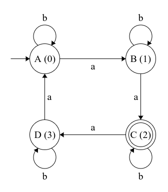

	***

* **Design a MDFA over ∑ = {a, b} such that every string accepted must contain odd occurance of substring 'ab'**

	***

	For odd number |W| = 1(mod 2)

	For even number |W| = 0(mod 2)

	but here we want |W|ab = 1(mod 2)

	What we ant is something like this:

	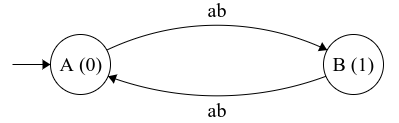

	But since we know:

	δ: Qx∑->Q

	and here ∑ can be only one symbol. So we can have this:

	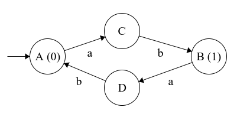

	Now all we need is to complete the DFA.

	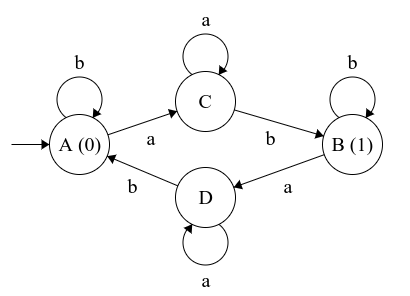

	Still it is not complete as for string say 'aba', there is an odd occurence of 'ab', but in our DFA the string is not accepted. To make this correct what we have to do is make D as a final state. As when we come to B, we have one odd occurence of 'ab', but until we reach A again we still have the odd occurence. So the final DFA is:

	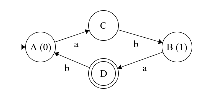

	***

* **How many different dfa can be designed with fixed initial state over ∑ = {a, b} and number of states is two**

	***

	If we carefully look we have 5 parameters in DFA

	DFA = {Q, q0, ∑, F, δ}

	In given question,

	Q -> fixed number of state i.e. we cannot change this.

	q0 -> fixed initial state i.e. we cannot change this.

	∑ -> fixed number of symbols i.e. we cannot change this.

	The only two paramaeter in the domain which we can tweek is F and δ.

	We can have 4 combinations of final states:

	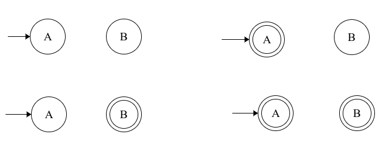

	Also for each combination the choice for transition function is:

	| | a | b |
	| :---: | :---: | :---: |
	| A | A, B | A, B |
	| B | A, B | A, B|

	Therefore the number of combination are:

	| | a | b |
	| :---: | :---: | :---: |
	| A | 2 | 2 |
	| B | 2 | 2|

	**2x2x2x2 = 16**.

	Also we have 4 combinations for final state.

	Therefore total number of DFA which can be design = **4x16 = 64**

	The general formula:

	Let, |Q| = m

	|∑| = n

	So total number of final state = 2m

	Total number of transitions possible

	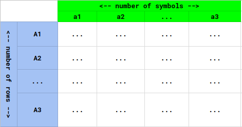

	(number od states)x(number of symbols) = mmxn

	Therefore total number of DFA possible = 2mxmmxn

	***

* **In above 64 DFA, how many will accept ∑\***

	***

	The one where both states are final state 

	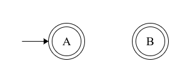

	will accept the universal language.

	The one where none of the state are final state 

	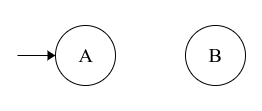

	will be rejected.

	The one where the initial state is not a final state 

	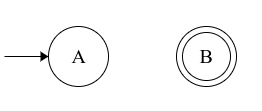

	will be rejected. Because null string is not accepted.

	The one where the initial state is a final state,

	

	if we make the second state unreachable state then every string will halt on A and thus we have a DFA that accepts ∑\*.

	There are following possibilities:

	| | a | b |
	| :---: | :---: | :---: |
	| A | A | A |
	| B | 2 | 2|

	or if we draw:

	

	Therefore the total number of possibiities = 4 + 16 = 20

* **In above 64 DFA, how many will accept empty language**

	null string does not belongs to empty language. An empty language does not contains anything and the DFA for that accept only ϕ.
	***

	The one where both states are final state 

	

	will be rejected. As it accept all strings.

	The one where none of the state are final state 

	

	will accepted as it does not even accepts ϵ.

	The one where the initial state is a final state.

	

	will be rejected as it accepts ϵ.

	The one where the initial state is not a final state 

	

	will be accepted for some case. Where we do not go to B.

	There are following possibilities:

	| | a | b |
	| :---: | :---: | :---: |
	| A | A | A |
	| B | 2 | 2|

	Therefore the total number of possibiities = 4 + 16 = 20

	***

* **Design a DFA over an alphabet ∑ = {a, b} such that it accepts all the strings starting with 'ab'** *and* **|W| = 3 (mod 4)**

	***

	

	Here we are designing based on 2 conditions we have learned. 

	First is to design a DFA starting from a particular string. If string length is 'n', then DFA has 'n+2' states.

	Second is to design a DFA of specific length. If length is 'm' then number of states are also 'm'.

	When two conditions are me conbine the number of states is equal to one less than the states combine in the two conditions.

	Here it, n+2+m-1 = n+m+1 = 2+4+1 = 7 states.

	If we want a string starting with 'aabaa' and |W| = 2(mod 5), then total number of states required = 5 + 2 + 5 - 1 = 11.

	***

* **Design a DFA over an alphabet ∑ = {0, 1} such that it accepts all the strings where |W|0 = 0(mod 2) i.e. even and |W|1 = 1(mod 2) i.e. odd**

	***

	We can have 1 count vertically and 0 count horizontally.

	

	If we construct a DFA of only even 0:

	

	If we construct a DFA of only odd 1:

	

	Multiplying states of each one we see that we have 4 states (A+B)(C+D) = AC + AD + BC + BD

	Now **A on 0 goes to B** and **C on 0 goes to C**, therefore **AC on 0 goes to BC**.

	Similarly we can find for other three state and the final state diagram is 0.

	

	Since A is final state for even number of 0's and D is final state for odd number of 1's. Therefore we have AD as final state.

	**NOTE: ince in question we have** *and* **we only include that state which have both A and D. If we had** *or* **inbetween we have to include any state that contains A or D.**

	***

* **Design a MDFA over ∑ = {a, b} such that every string accepted does not contains 'abb'**

	For this what we have to do is first construct a DFA which accepts the string containing 'abb' as substring. 

	

	Then just complement all the final states and non-final states.

	

	**NOTE: Since DFA is complete, so we can complement it.**

	***

### Minimization of DFA

* Capability of the automata shoould be same but the state much be reduce.

* There can be more than one DFA for a particular language.

* If we have a regular language say RL1 and 3 DFA - DFA1, DFA2 and DFA3, then there exist a minimum DFA which can be obtain by reducing any of these 3 DFA and that **minimize DFA is unique**.

* If absence of a state affect the working (language acceptibility) of the DFA then that state is called **productive state**.

* If presence or absence of a state does not affect the working of a DFA then that state is called **non-productive state**.

	* From a state if you can't reach a final state whatsoever, then that state is called **dead state.**

		* every machine don't have a dead state.

		* a machine can have more than one dead state.

		* but **to minimize the DFA we need to combine all dead state into one dead state**.

	* If there is no path available to read a state then, that state is called a **unreachable state**.
		* remove them directly

	* two states (say A and B), are said to be **equal states**, if δ\*(A, x) goes to finals state and δ\*(B, x) goes to finals state, or if if δ\*(A, x) goes to non-finals state and δ\*(B, x) goes to non-finals state.
		* combine all the equal state into one state.

	
